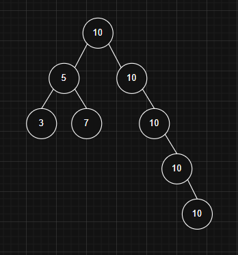
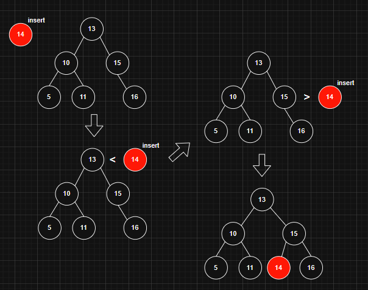
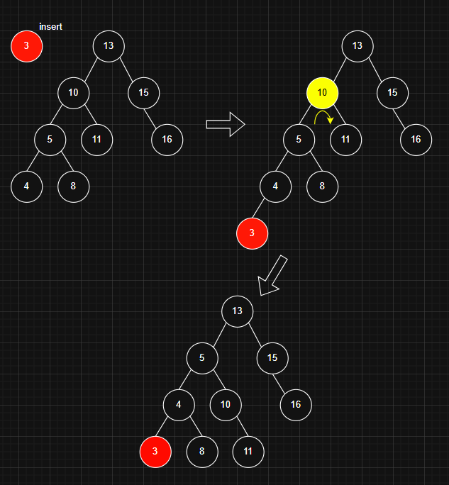
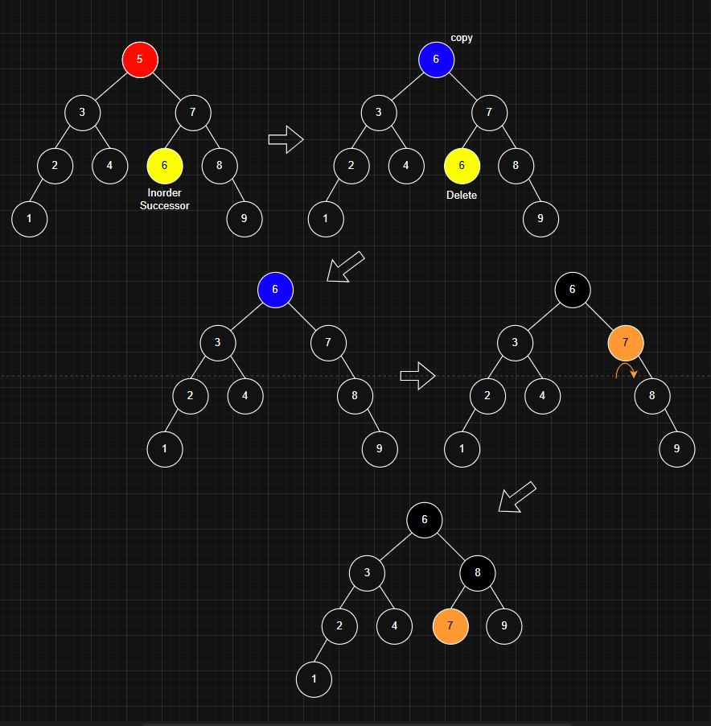

## AVL Tree 란?

AVL 트리는 자기 균형 이진 탐색 트리(Binary Search Tree)로,  
어떤 노드에 대해서도 왼쪽 서브트리와 오른쪽 서브트리의 높이 차이가 1을 초과하지 않아야 한다.  
이 높이 차이를 나타내는 값을 `균형 인수(Balance Factor)`라고 한다.  
`균형 인수`는 `왼쪽 서브트리의 높이 - 오른쪽 서브트리의 높이`로 정의된다.  

  
  
---
### AVL Tree의 시간 복잡도

| 연산      | 시간 복잡도 | 설명                      |
|-----------|-------------|---------------------------|
| 검색      | `O(log n)`  | 루트에서 시작하여 이진 탐색을 수행 |
| 삽입      | `O(log n)`  | 삽입 후 최대 `O(log n)`개의 노드에서 회전 발생 |
| 삭제      | `O(log n)`  | 삭제 후 최대 `O(log n)`개의 노드에서 회전 발생 |
| 최대값    | `O(log n)`  | 가장 오른쪽 노드 탐색     |
| 최소값    | `O(log n)`  | 가장 왼쪽 노드 탐색       |
| floor(x)  | `O(log n)`  | x 이하의 값 중 최대값 탐색 |
| ceiling(x)| `O(log n)`  | x 이상의 값 중 최소값 탐색 |

AVL 트리의 높이는 `O(log n)`으로 제한되므로, 모든 연산이 `O(log n)`의 시간 복잡도를 갖는다.  
일반적인 BST의 경우 트리의 높이가 최대 `O(n)`까지 증가할 수 있어 성능 저하가 발생할 수 있다.
  
  
---
### AVL Tree & BST 의 차이

모든 `AVL 트리는 이진 탐색 트리(BST)`이지만, `모든 BST가 AVL 트리는 아니다.`


AVL 트리는 BST의 기본 조건(왼쪽 < 루트 < 오른쪽)을 만족하며,  
추가로 서브트리 간의 높이 차이(균형 인수)가 1 이하인 균형 조건도 만족해야 한다.  
반면 일반 BST는 `균형 조건을 고려하지 않기 때문에,`  
한쪽으로 편향된 트리가 형성되어 높이가 크게 증가할 수 있다.  
이러한 구조는 AVL 트리의 정의를 만족하지 않는다.
  
  
---
### AVL Tree의 중복 값이 있다면?

AVL 트리는 왼쪽 서브트리에는 더 작은 값, 오른쪽 서브트리에는 더 큰 값만 위치해야 하므로 일반적으로 중복 값을 허용하지 않는다.  
`중복 값을 허용할 경우 다음과 같은 문제가 발생`한다.

### AVL Tree는 중복 값을 허용하지 않는가?
중복 값을 허용한다고 가정하고 AVL Tree에 그대로 삽입해 보면 다음과 같은 형태된다.  



이 구조는 사실상 **한쪽으로 치우친 연결 리스트**와 다를 바 없으며, **AVL 트리의 균형 조건**이 깨지게 된다.

1. **균형 붕괴**: 중복 값이 한쪽으로 계속 삽입되면 트리의 균형이 무너지고, `빈번한 회전이 발생하게 된다.`
2. **비효율적인 구조**: 트리의 높이가 증가하면서 시간 복잡도가 `O(log n)`을 넘어서게 된다.
3. **데이터 처리의 모호성**: 검색이나 삭제 시 어느 중복 노드를 대상으로 연산할지 명확하지 않다.
  
  
---
### AVL Tree의 회전

AVL 트리는 삽입 또는 삭제 연산 후 트리의 `균형이 깨질 수 있다.`  
이때 `회전을 통해 균형을 복원`한다. 회전의 종류는 다음과 같다.

- **LL 회전 (Right Rotation)**
- **RR 회전 (Left Rotation)**
- **LR 회전 (Left-Right Rotation)**
- **RL 회전 (Right-Left Rotation)**

불균형의 유형에 따라 하나의 회전 또는 두 단계의 회전을 수행하여 균형을 회복한다.

  
불균형이 발생한 노드 A의 왼쪽 자식 B의 왼쪽 서브트리 쪽에서 높이가 증가하여 불균형이 생긴 경우이다.

1. B를 새로운 서브트리의 루트로 설정한다.
2. 노드 A의 왼쪽 연결을 해제하고, A를 B의 오른쪽 자식으로 연결한다.
3. 노드 B가 원래 A가 차지하던 위치로 올라간다.

  
불균형이 발생한 노드 A의 오른쪽 자식 B의 오른쪽 서브트리 쪽에서 높이가 증가하여 불균형이 생긴 경우이다.

1. B를 새로운 서브트리의 루트로 설정한다.
2. 노드 A의 오른쪽 연결을 해제하고, A를 B의 왼쪽 자식으로 연결한다.
3. 노드 B가 원래 A가 차지하던 위치로 올라간다.

  
불균형이 발생한 노드 A의 왼쪽 자식 B의 오른쪽 서브트리 쪽에서 높이가 증가하여 불균형이 생긴 경우이다.

### 🔸 1단계: B 기준 **Left Rotation**

B는 루트에서 아래로 내려가고, C가 B의 왼쪽 자식이 된다.

### 🔸 2단계: C 기준 → **LL Case (Right Rotation)**

  
불균형이 발생한 노드 A의 오른쪽 자식 B의 왼쪽 서브트리 쪽에서 높이가 증가하여 불균형이 생긴 경우이다.

### 🔸 1단계: B 기준 **Right Rotation**

B는 루트에서 아래로 내려가고, C가 B의 오른쪽 자식이 된다.

### 🔸 2단계: A 기준 → **RR Case (Left Rotation)**
  
  
---

### AVL Tree의 삽입

1. AVL 트리에 값을 삽입할 때는 루트 노드부터 시작하여 현재 노드와 삽입할 값을 비교한다.
2. 삽입할 값이 현재 노드의 값보다 작으면 왼쪽 서브트리로 이동한다.
    - 만약 왼쪽 자식 노드가 없다면, 그 위치에 새 노드를 삽입한다.
3. 반대로 삽입할 값이 현재 노드의 값보다 크면 오른쪽 서브트리로 이동한다.
    - 오른쪽 자식 노드가 없으면, 그 위치에 새 노드를 삽입한다.
4. 삽입이 완료된 후에는 트리의 균형을 유지하기 위해 필요한 회전 연산을 수행한다.


  
  
---
### AVL Tree 삭제

1. 일반 이진 탐색트리 삭제와 마찬가지로 노드를 삭제할 때, 삭제할 노드가 두 자식을 가진 경우에는 해당 노드를 바로 삭제하지 않는다. 
    대신 `중위 후속자(Inorder Successor)`를 찾아 그 값으로 삭제 대상 노드를 대체한다.
2. 삭제 후, 중위 후속자가 있던 위치에서 노드를 삭제한다.
3. 삭제가 완료된 뒤에는 조상 노드들로 올라가면서 균형 인수를 갱신한다.
4. 불균형한 노드가 발견되면 적적한 회전 연산을 수행하여 트리의 균형을 맞춘다.
  
### 중위 후속자가 하는 역할 정리

1. 삭제할 노드가 두 자식을 가지고 있을 때,
2. 중위 후속자는 그 노드보다 큰 값 중에서 가장 작은 노드이다.
3. 이 노드의 값을 삭제할 노드에 복사하여 이진 탐색 트리의 속성을 유지한다.
  
### 중위 후속자 판별 방법

1. 오른쪽 자식이 있는 경우
    
    > 후속자는 오른쪽 서브트리에서 가장 왼쪽 노드 (최소값 노드)이다.
    
2. 오른쪽 자식이 없는 경우
    
    > 후속자는 조상 중에서 현재 노드보다 큰 값을 처음 만나는 노드이다.  



---

### AVL Tree 탐색

1. 현재 노드(루트)부터 시작한다.
2. 찾고자 하는 값이
    - 현재 노드보다 작으면 왼쪽 서브트리로 이동한다.
    - 현재 노드보다 크면 오른쪽 서브트리로 이동한다.
    - 같으면 검색에 성공한다.
3. 서브트리를 반복적으로 따라가며 값을 찾는다.
4. 값을 찾지 못하면 `None` 또는 `검색 실패`로 처리한다.

---

### 코드

```c
// C program to implement the avl tree
#include <stdio.h>
#include <stdlib.h>

// AVL Tree node
struct Node {
    int key;
    struct Node* left;
    struct Node* right;
    int height;
};

// Function to get height of the node
int getHeight(struct Node* n)
{
    if (n == NULL)
        return 0;
    return n->height;
}

// Function to create a new node
struct Node* createNode(int key)
{
    struct Node* node
        = (struct Node*)malloc(sizeof(struct Node));
    node->key = key;
    node->left = NULL;
    node->right = NULL;
    node->height = 1; // New node is initially added at leaf
    return node;
}

// Utility function to get the maximum of two integers
int max(int a, int b)
{
    return (a > b) ? a : b;
}

// Right rotate subtree rooted with y
struct Node* rightRotate(struct Node* y)
{
    struct Node* x = y->left;
    struct Node* T2 = x->right;

    // Perform rotation
    x->right = y;
    y->left = T2;

    // Update heights
    y->height = max(getHeight(y->left), getHeight(y->right)) + 1;
    x->height = max(getHeight(x->left), getHeight(x->right)) + 1;

    // Return new root
    return x;
}

// Left rotate subtree rooted with x
struct Node* leftRotate(struct Node* x)
{
    struct Node* y = x->right;
    struct Node* T2 = y->left;

    // Perform rotation
    y->left = x;
    x->right = T2;

    // Update heights
    x->height = max(getHeight(x->left), getHeight(x->right)) + 1;
    y->height = max(getHeight(y->left), getHeight(y->right)) + 1;

    // Return new root
    return y;
}

// Get balance factor of node n
int getBalance(struct Node* n)
{
    if (n == NULL)
        return 0;
    return getHeight(n->left) - getHeight(n->right);
}

// Insert a key in the subtree rooted with node and returns new root of subtree
struct Node* insertNode(struct Node* node, int key)
{
    // 1. Perform the normal BST insertion
    if (node == NULL)
        return createNode(key);

    if (key < node->key)
        node->left = insertNode(node->left, key);
    else if (key > node->key)
        node->right = insertNode(node->right, key);
    else // Equal keys are not allowed in AVL tree
        return node;

    // 2. Update height of this ancestor node
    node->height = 1 + max(getHeight(node->left), getHeight(node->right));

    // 3. Get the balance factor to check whether this node became unbalanced
    int balance = getBalance(node);

    // If node is unbalanced, then try the 4 cases

    // Left Left Case
    if (balance > 1 && key < node->left->key)
        return rightRotate(node);

    // Right Right Case
    if (balance < -1 && key > node->right->key)
        return leftRotate(node);

    // Left Right Case
    if (balance > 1 && key > node->left->key) {
        node->left = leftRotate(node->left);
        return rightRotate(node);
    }

    // Right Left Case
    if (balance < -1 && key < node->right->key) {
        node->right = rightRotate(node->right);
        return leftRotate(node);
    }

    // Return the unchanged node pointer
    return node;


}

```
---

### 참고한 자료

- GeeksforGeeks의 [Introduction to AVL Tree](https://www.geeksforgeeks.org/introduction-to-avl-tree/)
- GeeksforGeeks의 [Insertion in an AVL Tree](https://www.geeksforgeeks.org/insertion-in-an-avl-tree/)
- GeeksforGeeks의 [Deletion in an AVL Tree](https://www.geeksforgeeks.org/deletion-in-an-avl-tree/)


---
</br></br></br>


# 레드 블랙 트리(Red-Black Tree)
자가 균형 이진 탐색 트리(Balanced-BST)인 레드 블랙 트리의 구조와 동작 원리를 이해하고, 삽입과 삭제 연산에서 균형을 유지하는 방법을 학습한다.

| 레드 블랙 트리는 최악의 경우에도 O(log n)의 성능을 보장하는 균형 트리를 사용하여 이진 탐색 트리(BST)의 단점을 레드 블랙 트리를 통해 극복할 수 있다.

# 주요 키워드
| 항목 | 설명 |
|--------|--------|
| [소제목](https://jungle9.gitbook.io/kj-book-guide/algorithm#key)   | 핵심 개념 및 원리 요약   |
| [코드예시](https://jungle9.gitbook.io/kj-book-guide/algorithm#graph)   | Python 코드 기반 설명  |
| [영상첨부설정](https://jungle9.gitbook.io/kj-book-guide/algorithm#excute) | 영상 및 이미지 첨부 방법 안내 |

## 레드 블랙 트리란
개념 : 이진 탐색 트리(BST)의 일종인 레드-블랙 트리는 각 노드가 `빨간색` 또는 `검은색`의 추가 속성을 가진 `self-balancing 바이너리 검색 트리`이다. 이러한 트리의 주요 목표는 삽입 및 삭제 시 균형을 유지하여 효율적인 데이터 검색 및 조작을 보장한다.


## 레드 블랙 트리의 속성
1. 노드 색상 : 각 노드는 레드 혹은 블랙 색상이다.
2. 루트 노드 : 루트는 언제나 블랙 색상이다.
3. 레드 노드 : 레드 노드는 자식으로 레드를 가질 수 없다. (레드 노드의 자식은 검정색이다)
4. 어떤 노드에서 그 자손의 모든 리프 노드(즉, null 노드)로 가는 모든 경로에는 같은 수의 검은색 노드가 존재해야 한다.

```
             (B)
          /       \
        (R)       (B)
       /             \
     (B)             (R)
  /       \        /     \
null(B) null(B) null(B) null(B)
```

5. 리프 노드 : NIL(Null Leaf)은 언제나 블랙이다.

## 왜 레드 블랙 트리일까?
모든 삽입 및 삭제 후에도 트리의 높이가 O(log n)로 유지되도록 하면 이러한 모든 작업에 대해 O(log n)의 상한을 보장할 수 있습니다. Red-Black 트리의 높이는 항상 O(log n)이며, 여기서 n은 트리의 노드 수 이다.

| **알고리즘** | **시간 복잡도** |
| --- | --- |
| 검색 | O(log n) |
| 삽입 | O(log n) |
| 삭제 | O(log n) |

## AVL와 비교
AVL 트리는 레드 블랙 트리에 비해 균형이 더 잘 잡혀 있다. 

삽입과 삭제가 더 자주 있다면 AVL 트리 보다, 레드 블랙 트리 사용하는 것이 좋다.

검색이 주요 작업이라면 AVL 트리 사용하는 것이 좋다.

하지만 지속적인 삽입, 삭제가 발생한다면 레드 블랙 트리 사용도 좋지 않을 수 있다.

## 레드 블랙 트리의 기본 동작

1. 삽입
2. 검색
3. 삭제
4. 회전

### 삽입

**삽입 방법**

1. BST 삽입 : BST 처럼 새로운 노드를 삽입 (삽입되는 노드의 색은 항상 레드이다)
2. 위반 시 수정
- **케이스 1: 삼촌이 레드일 때**: 할아버지와 삼촌의 컬러를 블랙으로 변경하고 할아버지 노드를 레드로 바꾼다.
    
    
    
    단, 할아버지 노드가 root이면 블랙을 유지한다.
    
- **케이스 2: 삼촌이 블랙일 때**:
    - 서브 케이스 2.1: 삽입 노드가 오른쪽일 때: Left-Right 회전
        
        
        
    - 서브 케이스 2.2: 삽입 노드가 왼쪽 일 때: Right 회전
        
        
        

### 검색

레드 블랙 트리의 검색은 BST와 비슷하다.

**검색 방법**

1. 루트에서 시작
2. 트리를 순회
    - 타겟 값과 현재 노드가 같을 때 완료
    - 타겟 값이 현재 노드 보다 작다면 왼쪽으로 이동
    - 타겟 값이 현재 노드 보다 크다면 오른쪽으로 이동
3. 반복 : 타겟 값을 찾을 때까지 반복하거나 NIL(Null Leaf)에 도달할 때까지 반복한다.

### 삭제

삭제 방법

1. BST 삭제: 노드 삭제 시 BST 규칙을 따른다.
2. 레드 노드: 레드 노드 일 경우 BST 규칙을 따르며 삭제 한다.
3. 더블 블랙 수정: 블랙 노드가 삭제될 시, “더블 블랙” 조건이 발생한다.

> `더블 블랙이란?`
레드 블랙 트리에서 노드를 삭제하면, 트리의 블랙 노드가 부족해지는 상황을 말한다.
**지금 black height가 맞지 않음을 알려주는 마커** 같은 역할을 한다.
> 
> 
> 이건 "**여기 아직 검정이 하나 부족해**"라는 신호이자, 이후의 보정을 유도하는 장치다.
> 

> **extra 블랙**
삭제되는 색이 블랙이고, 4번 위반일 때 `extra 블랙 부여`
이를 부여 받은 노드는 `더블 블랙` 혹은 `레드 앤드 블랙`이 된다.

대체한 노드가 레드 앤드 블랙이 되었다면 블랙으로 바꿔주면 끝이다.
> 
> - 30(B)를 삭제했어.
> - 그 자리를 대체한 25(R)는 원래 red였기 때문에, 그대로는 black height가 부족해.
> - 그래서 25에 **extra black을 부여해서 "red-and-black" 상태**로 만들어.
> - 그 상태에서는 black height가 2가 되므로, **일시적으로는 속성 4를 만족하게 된다.
> 
> extra 블랙은 임시 봉합이다.**

- 케이스 1: 형제 노드가 레드일 때: 할아버지를 회전 시키고, 할아버지와 형제 노드의 색상을 변경한다.


- 케이스 2: 형제 노드가 블랙일 때:
    - 서브케이스 2.1: 형제 노드의 자식이 블랙일 때: 형제의 컬러를 바꾸고 더블 블랙을 위로 보낸다.
        
        
        
    - 2.2: 형제의 자식 중 하나라도 레드일 때:
        - 2.2.1 형제의 먼 자식이 레드일 때: 할아버지와 형제를 회전하고 알맞게 컬러를 수정한다.
            
            작동: 이 조건일 때 `오른쪽 형제`는 할아버지의 색으로, `오른쪽 형제의 오른쪽 자녀`는 블랙으로, 할아버지는 블랙으로 바꾼 후 `할아버지`를 기준으로 왼쪽 회전한다.  (오른쪽 왼쪽 바꿔도 성립)
            
            
            
        - 2.2.2 형제의 가까운 자식이 레드일 때: 형제와 형제의 자식을 회전 시킨 후 케이스(2.2.1)를 통해 알맞게 수정한다.
        
        
## 사용 예시
1. maps & sets
2. 우선순위 큐
3. 파일 시스템
4. 인-메모리 데이터베이스
5. 그래픽과 게임 개발

# 코드예시
아래는 C 언어로 작성한 자료구조 예시입니다.

```c
#include <iostream>
using namespace std;

// 노드 클라스
struct Node {
    int data;
    string color;
    Node *left, *right, *parent;

    Node(int data)
        : data(data)
        , color("RED")
        , left(nullptr)
        , right(nullptr)
        , parent(nullptr)
    {
    }
};

// 레드 블랙 트리 클라스
class RedBlackTree {
private:
    Node* root;
    Node* NIL;

    // 왼쪽 회전
    void left_rotate(Node* x)
    {
        Node* y = x->right;
        x->right = y->left;
        if (y->left != NIL) {
            y->left->parent = x;
        }
        y->parent = x->parent;
        if (x->parent == nullptr) {
            root = y;
        }
        else if (x == x->parent->left) {
            x->parent->left = y;
        }
        else {
            x->parent->right = y;
        }
        y->left = x;
        x->parent = y;
    }

    // 오른쪽 회전
    void right_rotate(Node* x)
    {
        Node* y = x->left;
        x->left = y->right;
        if (y->right != NIL) {
            y->right->parent = x;
        }
        y->parent = x->parent;
        if (x->parent == nullptr) {
            root = y;
        }
        else if (x == x->parent->right) {
            x->parent->right = y;
        }
        else {
            x->parent->left = y;
        }
        y->right = x;
        x->parent = y;
    }

    // 삽입 후 수정
    void fix_insert(Node* k)
    {
        while (k != root && k->parent->color == "RED") {
            if (k->parent == k->parent->parent->left) {
                Node* u = k->parent->parent->right; // 삼촌
                if (u->color == "RED") {
                    k->parent->color = "BLACK";
                    u->color = "BLACK";
                    k->parent->parent->color = "RED";
                    k = k->parent->parent;
                }
                else {
                    if (k == k->parent->right) {
                        k = k->parent;
                        leftRotate(k);
                    }
                    k->parent->color = "BLACK";
                    k->parent->parent->color = "RED";
                    rightRotate(k->parent->parent);
                }
            }
            else {
                Node* u = k->parent->parent->left; // 삼촌ㅋ
                if (u->color == "RED") {
                    k->parent->color = "BLACK";
                    u->color = "BLACK";
                    k->parent->parent->color = "RED";
                    k = k->parent->parent;
                }
                else {
                    if (k == k->parent->left) {
                        k = k->parent;
                        rightRotate(k);
                    }
                    k->parent->color = "BLACK";
                    k->parent->parent->color = "RED";
                    leftRotate(k->parent->parent);
                }
            }
        }
        root->color = "BLACK";
    }

    // 순서 이동 도우미
    void inorder_helper(Node* node)
    {
        if (node != NIL) {
            inorderHelper(node->left);
            cout << node->data << " ";
            inorderHelper(node->right);
        }
    }

    // 검색 도우미
    Node* search_helper(Node* node, int data)
    {
        if (node == NIL || data == node->data) {
            return node;
        }
        if (data < node->data) {
            return searchHelper(node->left, data);
        }
        return searchHelper(node->right, data);
    }

public:
    // Constructor
    RedBlackTree()
    {
        NIL = new Node(0);
        NIL->color = "BLACK";
        NIL->left = NIL->right = NIL;
        root = NIL;
    }

    // 삽입
    void insert(int data)
    {
        Node* new_node = new Node(data);
        new_node->left = NIL;
        new_node->right = NIL;

        Node* parent = nullptr;
        Node* current = root;

        // BST insert
        while (current != NIL) {
            parent = current;
            if (new_node->data < current->data) {
                current = current->left;
            }
            else {
                current = current->right;
            }
        }

        new_node->parent = parent;

        if (parent == nullptr) {
            root = new_node;
        }
        else if (new_node->data < parent->data) {
            parent->left = new_node;
        }
        else {
            parent->right = new_node;
        }

        if (new_node->parent == nullptr) {
            new_node->color = "BLACK";
            return;
        }

        if (new_node->parent->parent == nullptr) {
            return;
        }

        fix_insert(new_node);
    }

    // 순서 이동
    void inorder() { inorder_helper(root); }

    // 검색
    Node* search(int data)
    {
        return search_helper(root, data);
    }
};

int main()
{
    RedBlackTree rbt;

    rbt.insert(10);
    rbt.insert(20);
    rbt.insert(30);
    rbt.insert(15);

    // 순서 이동
    cout << "Inorder traversal:" << endl;
    rbt.inorder(); // Output: 10 15 20 30

    // 노드 검색
    cout << "\nSearch for 15: "
         << (rbt.search(15) != rbt.search(0))
         << endl; // Output: 1 (true)
    cout << "Search for 25: "
         << (rbt.search(25) != rbt.search(0))
         << endl; // Output: 0 (false)

    return 0;
}
```

# 영상첨부설정
글로 설명하기 어려운 경우, 영상이나 이미지로 보충한다.

> 예시)      
[자료구조 설명 영상](https://youtube.com)

> 예시)    


# 문제 풀어보기
1. 레드 블랙 트리의 특성 5가지를 적으시오.
2. extra 블랙은 어떤 규칙을 위반 하였을 때 발생하는가?

# 참고
참고한 자료

GeeksforGeeks의 Red-Black Tree

이미지 출처

크래프톤 정글 이미지

외부 이미지 사용 시 라이선스 확인 필요

추가로 참고하면 좋은 자료

Visualgo

GitHub 검색: Red-Black Tree

주의사항

외부 콘텐츠를 인용할 경우, 반드시 출처를 명시하고 링크를 제공할 것

이미지, 도표 등은 직접 제작하거나, 라이선스가 허용된 자료만 사용할 것