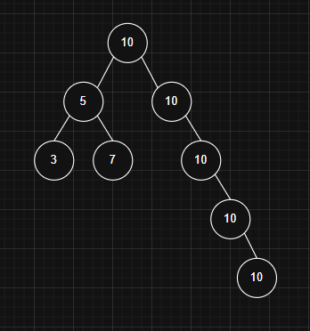
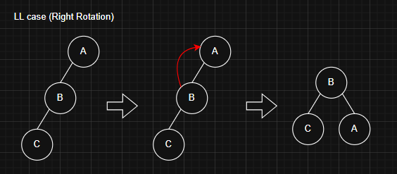
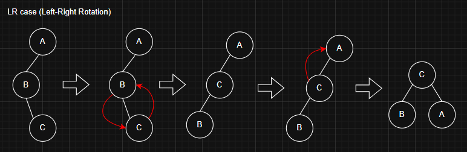
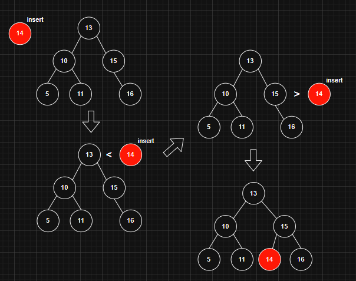
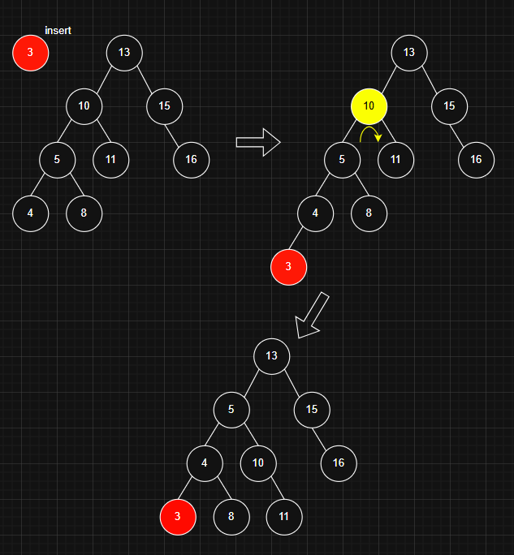
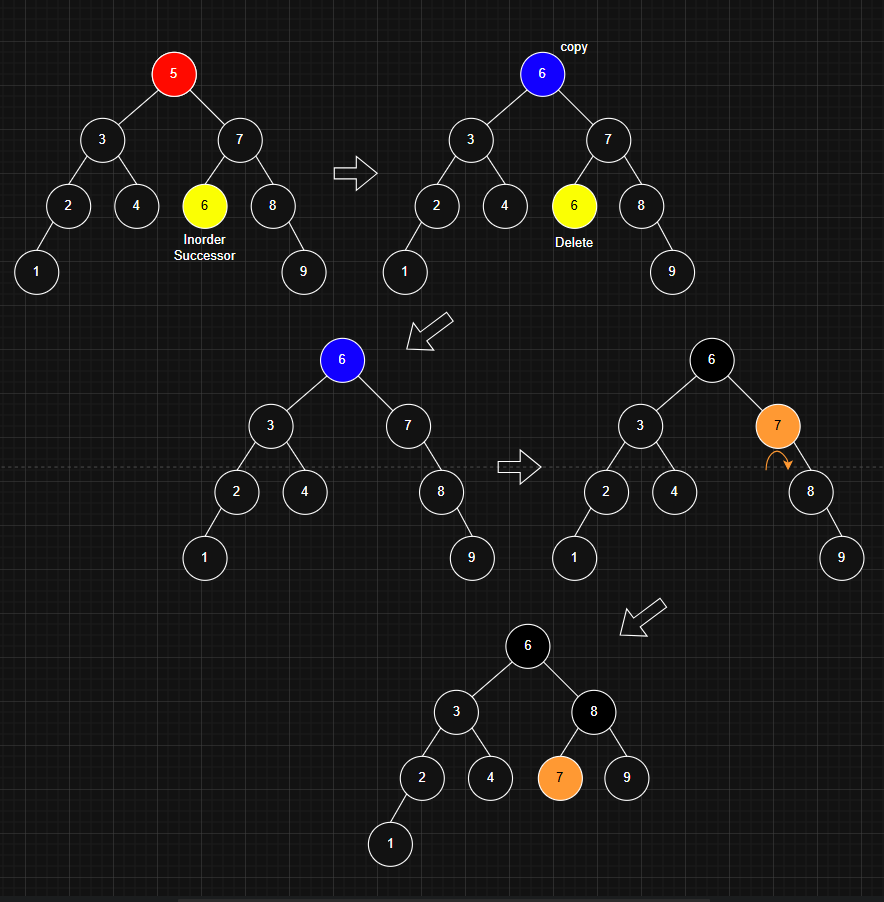

## AVL Tree 란?

AVL 트리는 자기 균형 이진 탐색 트리(Binary Search Tree)로,  
어떤 노드에 대해서도 왼쪽 서브트리와 오른쪽 서브트리의 높이 차이가 1을 초과하지 않아야 한다.  
이 높이 차이를 나타내는 값을 `균형 인수(Balance Factor)`라고 한다.  
`균형 인수`는 `왼쪽 서브트리의 높이 - 오른쪽 서브트리의 높이`로 정의된다.  

  
  
---
### AVL Tree의 시간 복잡도

| 연산      | 시간 복잡도 | 설명                      |
|-----------|-------------|---------------------------|
| 검색      | `O(log n)`  | 루트에서 시작하여 이진 탐색을 수행 |
| 삽입      | `O(log n)`  | 삽입 후 최대 `O(log n)`개의 노드에서 회전 발생 |
| 삭제      | `O(log n)`  | 삭제 후 최대 `O(log n)`개의 노드에서 회전 발생 |
| 최대값    | `O(log n)`  | 가장 오른쪽 노드 탐색     |
| 최소값    | `O(log n)`  | 가장 왼쪽 노드 탐색       |
| floor(x)  | `O(log n)`  | x 이하의 값 중 최대값 탐색 |
| ceiling(x)| `O(log n)`  | x 이상의 값 중 최소값 탐색 |

AVL 트리의 높이는 `O(log n)`으로 제한되므로, 모든 연산이 `O(log n)`의 시간 복잡도를 갖는다.  
일반적인 BST의 경우 트리의 높이가 최대 `O(n)`까지 증가할 수 있어 성능 저하가 발생할 수 있다.
  
  
---
### AVL Tree & BST 의 차이

모든 `AVL 트리는 이진 탐색 트리(BST)`이지만, `모든 BST가 AVL 트리는 아니다.`


AVL 트리는 BST의 기본 조건(왼쪽 < 루트 < 오른쪽)을 만족하며,  
추가로 서브트리 간의 높이 차이(균형 인수)가 1 이하인 균형 조건도 만족해야 한다.  
반면 일반 BST는 `균형 조건을 고려하지 않기 때문에,`  
한쪽으로 편향된 트리가 형성되어 높이가 크게 증가할 수 있다.  
이러한 구조는 AVL 트리의 정의를 만족하지 않는다.
  
  
---
### AVL Tree의 중복 값이 있다면?

AVL 트리는 왼쪽 서브트리에는 더 작은 값, 오른쪽 서브트리에는 더 큰 값만 위치해야 하므로 일반적으로 중복 값을 허용하지 않는다.  
`중복 값을 허용할 경우 다음과 같은 문제가 발생`한다.

### AVL Tree는 중복 값을 허용하지 않는가?
중복 값을 허용한다고 가정하고 AVL Tree에 그대로 삽입해 보면 다음과 같은 형태된다.  



이 구조는 사실상 **한쪽으로 치우친 연결 리스트**와 다를 바 없으며, **AVL 트리의 균형 조건**이 깨지게 된다.

1. **균형 붕괴**: 중복 값이 한쪽으로 계속 삽입되면 트리의 균형이 무너지고, `빈번한 회전이 발생하게 된다.`
2. **비효율적인 구조**: 트리의 높이가 증가하면서 시간 복잡도가 `O(log n)`을 넘어서게 된다.
3. **데이터 처리의 모호성**: 검색이나 삭제 시 어느 중복 노드를 대상으로 연산할지 명확하지 않다.
  
  
---
### AVL Tree의 회전

AVL 트리는 삽입 또는 삭제 연산 후 트리의 `균형이 깨질 수 있다.`  
이때 `회전을 통해 균형을 복원`한다. 회전의 종류는 다음과 같다.

- **LL 회전 (Right Rotation)**
- **RR 회전 (Left Rotation)**
- **LR 회전 (Left-Right Rotation)**
- **RL 회전 (Right-Left Rotation)**

불균형의 유형에 따라 하나의 회전 또는 두 단계의 회전을 수행하여 균형을 회복한다.

  
불균형이 발생한 노드 A의 왼쪽 자식 B의 왼쪽 서브트리 쪽에서 높이가 증가하여 불균형이 생긴 경우이다.

1. B를 새로운 서브트리의 루트로 설정한다.
2. 노드 A의 왼쪽 연결을 해제하고, A를 B의 오른쪽 자식으로 연결한다.
3. 노드 B가 원래 A가 차지하던 위치로 올라간다.

  
불균형이 발생한 노드 A의 오른쪽 자식 B의 오른쪽 서브트리 쪽에서 높이가 증가하여 불균형이 생긴 경우이다.

1. B를 새로운 서브트리의 루트로 설정한다.
2. 노드 A의 오른쪽 연결을 해제하고, A를 B의 왼쪽 자식으로 연결한다.
3. 노드 B가 원래 A가 차지하던 위치로 올라간다.

  
불균형이 발생한 노드 A의 왼쪽 자식 B의 오른쪽 서브트리 쪽에서 높이가 증가하여 불균형이 생긴 경우이다.

### 🔸 1단계: B 기준 **Left Rotation**

B는 루트에서 아래로 내려가고, C가 B의 왼쪽 자식이 된다.

### 🔸 2단계: C 기준 → **LL Case (Right Rotation)**

  
불균형이 발생한 노드 A의 오른쪽 자식 B의 왼쪽 서브트리 쪽에서 높이가 증가하여 불균형이 생긴 경우이다.

### 🔸 1단계: B 기준 **Right Rotation**

B는 루트에서 아래로 내려가고, C가 B의 오른쪽 자식이 된다.

### 🔸 2단계: A 기준 → **RR Case (Left Rotation)**
  
  
---

### AVL Tree의 삽입

1. AVL 트리에 값을 삽입할 때는 루트 노드부터 시작하여 현재 노드와 삽입할 값을 비교한다.
2. 삽입할 값이 현재 노드의 값보다 작으면 왼쪽 서브트리로 이동한다.
    - 만약 왼쪽 자식 노드가 없다면, 그 위치에 새 노드를 삽입한다.
3. 반대로 삽입할 값이 현재 노드의 값보다 크면 오른쪽 서브트리로 이동한다.
    - 오른쪽 자식 노드가 없으면, 그 위치에 새 노드를 삽입한다.
4. 삽입이 완료된 후에는 트리의 균형을 유지하기 위해 필요한 회전 연산을 수행한다.


  
  
---
### AVL Tree 삭제

1. 일반 이진 탐색트리 삭제와 마찬가지로 노드를 삭제할 때, 삭제할 노드가 두 자식을 가진 경우에는 해당 노드를 바로 삭제하지 않는다. 
    대신 `중위 후속자(Inorder Successor)`를 찾아 그 값으로 삭제 대상 노드를 대체한다.
2. 삭제 후, 중위 후속자가 있던 위치에서 노드를 삭제한다.
3. 삭제가 완료된 뒤에는 조상 노드들로 올라가면서 균형 인수를 갱신한다.
4. 불균형한 노드가 발견되면 적적한 회전 연산을 수행하여 트리의 균형을 맞춘다.
  
### 중위 후속자가 하는 역할 정리

1. 삭제할 노드가 두 자식을 가지고 있을 때,
2. 중위 후속자는 그 노드보다 큰 값 중에서 가장 작은 노드이다.
3. 이 노드의 값을 삭제할 노드에 복사하여 이진 탐색 트리의 속성을 유지한다.
  
### 중위 후속자 판별 방법

1. 오른쪽 자식이 있는 경우
    
    > 후속자는 오른쪽 서브트리에서 가장 왼쪽 노드 (최소값 노드)이다.
    
2. 오른쪽 자식이 없는 경우
    
    > 후속자는 조상 중에서 현재 노드보다 큰 값을 처음 만나는 노드이다.  



---

### AVL Tree 탐색

1. 현재 노드(루트)부터 시작한다.
2. 찾고자 하는 값이
    - 현재 노드보다 작으면 왼쪽 서브트리로 이동한다.
    - 현재 노드보다 크면 오른쪽 서브트리로 이동한다.
    - 같으면 검색에 성공한다.
3. 서브트리를 반복적으로 따라가며 값을 찾는다.
4. 값을 찾지 못하면 `None` 또는 `검색 실패`로 처리한다.

---

### 코드

```c
// C program to implement the avl tree
#include <stdio.h>
#include <stdlib.h>

// AVL Tree node
struct Node {
    int key;
    struct Node* left;
    struct Node* right;
    int height;
};

// Function to get height of the node
int getHeight(struct Node* n)
{
    if (n == NULL)
        return 0;
    return n->height;
}

// Function to create a new node
struct Node* createNode(int key)
{
    struct Node* node
        = (struct Node*)malloc(sizeof(struct Node));
    node->key = key;
    node->left = NULL;
    node->right = NULL;
    node->height = 1; // New node is initially added at leaf
    return node;
}

// Utility function to get the maximum of two integers
int max(int a, int b)
{
    return (a > b) ? a : b;
}

// Right rotate subtree rooted with y
struct Node* rightRotate(struct Node* y)
{
    struct Node* x = y->left;
    struct Node* T2 = x->right;

    // Perform rotation
    x->right = y;
    y->left = T2;

    // Update heights
    y->height = max(getHeight(y->left), getHeight(y->right)) + 1;
    x->height = max(getHeight(x->left), getHeight(x->right)) + 1;

    // Return new root
    return x;
}

// Left rotate subtree rooted with x
struct Node* leftRotate(struct Node* x)
{
    struct Node* y = x->right;
    struct Node* T2 = y->left;

    // Perform rotation
    y->left = x;
    x->right = T2;

    // Update heights
    x->height = max(getHeight(x->left), getHeight(x->right)) + 1;
    y->height = max(getHeight(y->left), getHeight(y->right)) + 1;

    // Return new root
    return y;
}

// Get balance factor of node n
int getBalance(struct Node* n)
{
    if (n == NULL)
        return 0;
    return getHeight(n->left) - getHeight(n->right);
}

// Insert a key in the subtree rooted with node and returns new root of subtree
struct Node* insertNode(struct Node* node, int key)
{
    // 1. Perform the normal BST insertion
    if (node == NULL)
        return createNode(key);

    if (key < node->key)
        node->left = insertNode(node->left, key);
    else if (key > node->key)
        node->right = insertNode(node->right, key);
    else // Equal keys are not allowed in AVL tree
        return node;

    // 2. Update height of this ancestor node
    node->height = 1 + max(getHeight(node->left), getHeight(node->right));

    // 3. Get the balance factor to check whether this node became unbalanced
    int balance = getBalance(node);

    // If node is unbalanced, then try the 4 cases

    // Left Left Case
    if (balance > 1 && key < node->left->key)
        return rightRotate(node);

    // Right Right Case
    if (balance < -1 && key > node->right->key)
        return leftRotate(node);

    // Left Right Case
    if (balance > 1 && key > node->left->key) {
        node->left = leftRotate(node->left);
        return rightRotate(node);
    }

    // Right Left Case
    if (balance < -1 && key < node->right->key) {
        node->right = rightRotate(node->right);
        return leftRotate(node);
    }

    // Return the unchanged node pointer
    return node;


}

```
---

### 참고한 자료

- GeeksforGeeks의 [Introduction to AVL Tree](https://www.geeksforgeeks.org/introduction-to-avl-tree/)
- GeeksforGeeks의 [Insertion in an AVL Tree](https://www.geeksforgeeks.org/insertion-in-an-avl-tree/)
- GeeksforGeeks의 [Deletion in an AVL Tree](https://www.geeksforgeeks.org/deletion-in-an-avl-tree/)