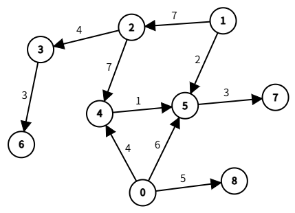
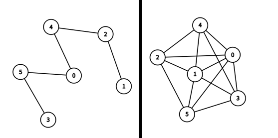
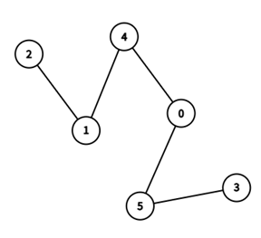
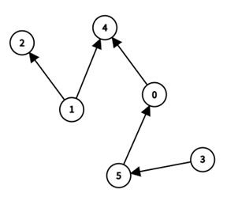
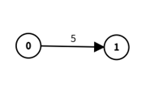
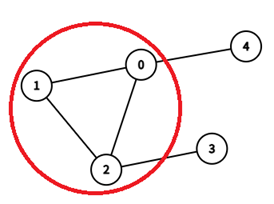

# 그래프(Graph)란?

서로 복잡하게 연결된 수많은 객체를 표현할 때, 일반적인 리스트나 트리 같은 자료구조만으로는 한계가 있다.

이처럼 얽히고설킨 관계를 직관적으로 모델링할 수 있게 해주는 자료구조가 바로 **그래프(Graph)**이다.

그래프를 이용하여 리스트나 트리로는 표현할 수 없는 복잡한 연결 구조를 명확하게 나타낼 수 있다.

## 그래프의 구성

### 정점(Vertex)

**정점(Vertex)**, 혹은 **노드(Node)**는 그래프를 구성하는 가장 기본 단위로, 그래프가 표현하고자 하는 **대상**을 나타낸다.

즉, 정점은 사람, 도시, 서버 등 우리가 모델링하고자 하는 대상이 되며, 그래프의 구조 속에서 중심 역할을 한다.

수학적으로 정점의 전체 집합을 $V$ 로 정의할 수 있으며, 집합 $V$ 는 일반적으로 $V = {v_1, v_2, \dots, v_n}$ 과 같이 표현할 수 있다.

각 정점 $v \in V$ 는 그래프를 구성하는 개별적인 정점을 나타내며, 정점의 총 개수 $n$ 은 곧, 집합 $V$ 의 원소 수인 $|V| = n$ 으로 표현할 수 있다.

### 간선(Edge)

**간선(Edge)**은 그래프 내 정점 간의 연결 관계를 나타내는 구성 요소로, 정점들 사이의 상호작용, 흐름, 또는 **관계**를 나타낼 수 있다.

사람 간의 관계, 도시 간의 도로, 서버간의 연결 등 다양한 맥락에서 간선은 관계의 본질을 담아내는 수단이 된다.

수학적으로 간선의 전체 집합을 $E$ 로 정의할 수 있으며, 간선의 집합 $E$ 는 정점 집합 $V$ 에 대한 이항관계(binary relation)로 간주할 수 있으며, 이는 $E \subseteq V \times V$ 로 표현할 수 있다.

각 간선 $e \in E$ 는 두 정점 사이의 연결을 의미하며, 간선의 총 개수 $m$ 은 곧, 집합 $E$ 의 원소 수인 $|E| = m$ 으로 표현할 수 있다.

### 그래프와의 관계

정점의 집합을 $V$, 간선의 집합을 $E$, 그래프가 $G$라고 했을 때, 이를 수학적 표현으로 $$G = (V, E)$$ 라고 할 수 있으며, 이를 통해 그래프의 크기나 복잡도를 나타낼 수 있게 된다.

이러한 수학적 표현은 알고리즘을 설계하고 분석하는 과정에서 시간 복잡도와 공간 복잡도를 평가하는 기준을 제공한다.

## 그래프의 특성

그래프는 다른 자료구조와 달리 관계의 방향성, 강도, 연결성 등을 표현할 수 있어 다양한 성질과 유형을 지닐 수 있게 된다.

### 밀도(Density)

그래프에서 말하는 **밀도(Density)**란, 정점들 사이에 현재 존재하는 간선의 수가 이론적으로 가능한 최대 간선 수에 비해 얼마나 많은지를 나타내는 지표를 말한다.

즉, 그래프가 얼마나 조밀하게 연결되어 있는지를 수치적으로 표현한 것으로, **현재 간선 수 / 최대 가능 간선 수**의 비율로 계산된다.

이를 통해 밀도가 낮은 그래프를 **희소 그래프(Sparse Graph)**, 밀도가 높은 그래프는 **밀집 그래프(Dense Graph)**라 한다.

### 무방향 그래프(Undirected Graph)와 방향 그래프(Directed Graph)

간선에 방향이 없는 경우, 이를 **무방향 그래프(Undirected Graph)**라 한다.

무방향 그래프에 정점 A와 정점 B에 간선이 존재한다면, A에서 B로 이동 할 수 있고 B에서 A로 이동할 수 있는 **양방향 관계**를 표현할 수 있다.

이는 간선 $e$ 에 대해 집합 {$u, v$} 로 나타낼 수 있으며, 집합의 특성상 두 정점의 순서는 중요하지 않다. 즉, {$u, v$} = {$v, u$} 이므로 상호 연결을 나타낸다.

간선에 특정한 방향이 존재하는 경우, 이를 **방향 그래프(Directed Graph)**라 한다.

방향 그래프에 정점 A에서 B로 방향하는 간선이 존재한다면, A에서 B로는 이동할 수 있지만 B에서 A로는 이동할 수 없는 **일방향 관계**를 표현할 수 있다.

이는 간선 $e$ 에 대해 순서쌍 $(u, v)$ 로 나타낼 수 있으며, $u$ 에서 $v$ 로 간다는 방향성을 명확히 드러낼 수 있다.

### 가중치 그래프(Weighted Graph)

간선에 일정한 **수치적 값**을 부여한 그래프를 **가중치 그래프(Weighted Graph)**라 말한다.

간선의 **가중치**는 이동할 때의 비용, 거리, 시간, 에너지 등을 의미할 수 있다.

가중치를 통해 단순히 정점 간의 연결 유무만을 나타내는 것이 아니라, 연결 강도나 조건을 수치적으로 표현할 수 있다.

### 사이클(Cycle)

그래프 내에서 특정한 정점에서 출발하여, 다시 출발한 정점으로 다시 돌아오는 경로가 존재할 경우, 해당 그래프는 **사이클(Cycle)**특성을 가진 그래프라고 한다.

이러한 사이클은 적어도 세 개 이상의 정점과 간선이 서로 연결되어 **순환하는 폐쇄 경로**를 형성해야 하며, 같은 정점을 한 번 이상 방문하게 되는 특징을 가진다.