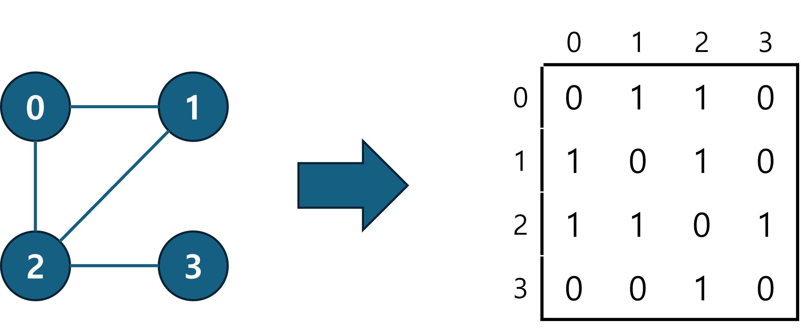

<script type="text/x-mathjax-config">  
        MathJax.Hub.Config({  
        tex2jax: {  
	        inlineMath: [ ['$','$'], ["\\(","\\)"] ],  
	        displayMath: [ ['$$','$$'], ["\\[","\\]"] ],  
	        processEscapes: true  
        },  
        });  
</script>  
<script type="text/javascript" src="https://cdn.mathjax.org/mathjax/latest/MathJax.js?config=TeX-MML-AM_CHTML">  
</script>  

# 인접 행렬이란?

인접 행렬(Adjacency Matrix)은 그래프를 표현하는 대표적인 2가지 방법 중 하나로, 그래프를 아래와 같이(그림 추가) 2차원 행렬로 표현하는 방법이다.



정점 집합 $V$와 간선 집합 $E$로 정의되는 그래프 $G=(V,E)$에 대한 인접행렬의 구조는 다음과 같다.

- 그래프 정점의 개수 $|V| = n$이라고 할 때, 인접 행렬 $A$는 $n \times n$의 정사각 행렬로 그려진다.

- 그래프의 정점은 행렬의 인덱스로 표현된다.
	- 행 인덱스 $i$ $(0≤i<n)$는 그래프 정점 $v_i$에 대응
	- 열 인덱스  $j$ $(0≤j<n)$는 그래프 정점 $v_j$에 대응

- 행렬 $A$에서 $i$번째 행 $j$번째 열에 위치한 요소 $a_{i,j}$는 다음과 같은 의미를 가진다.
	- $a_{i,j} = 1$ → 정점 $i$에서 정점$j$로 가는 간선이 존재한다
	- $a_{i,j} = 0$ → 정점 $i$에서 정점$j$로 가는 간선이 존재하지 않는다
	- 가중치 그래프일 경우, 1 대신 가중치 값을 사용한다.

그림1에서 알 수 있듯 무방향 그래프의 인접 행렬은 주 대각선을 따라 대칭이다. 이는 무방향 그래프에서는 정점 $i$에서 정점 $j$로 가는 간선이 존재하면, 그 간선을 통해 정점 $j$에서 정점 $i$로의 이동도 가능하다는 사실에서 기인한다. 따라서 간선 $(i, j)$가 존재하는 것은 동시에 간선 $(j, i)$가 존재한다는 것을 의미한다. 무방향 그래프에서 두 간선은 동일한 것으로 취급되며, 행렬의 $a_{i,j}$와  $a_{j,i}$는 동일한 값을 가지게 된다.

반면 방향 그래프는, 간선 $(i, j)$와 $(j, i)$가 서로 다르다. 정점 $i$에서 정점 $j$로 가는 간선이 존재해도, $j$에서 $i$로의 간선이 별도로 존재하지 않는 한 이동할 수 없다. 간선이 방향성을 가지기 때문이다. 따라서 무방향 그래프와 달리 인접행렬이 대칭성을 가지지 않는다.

C언어로는 인접 행렬을 이차원 배열을 이용해 생성한다. 이어지는 코드는 그림1의 인접행렬을 C언어로 구현한 간단한 코드이다. 

```C
#include <stdio.h>  
#define N 4  
  
void add_edge(int mat[N][N], int i, int j) {  
    // 간선 추가 함수로, 무방향 그래프이기 때문에, (i,j)와 (j,i)에 모두 1 값을 저장한다.  
    mat[i][j] = 1;  
    mat[j][i] = 1;  
}  
  
void display_matrix(int mat[N][N]) {  
    for (int i = 0; i < N; i++) {  
        for (int j = 0; j < N; j++)  
            printf("%d ", mat[i][j]);  
        printf("\n");  
    }  
}  
  
int main() {  
    // 4개의 노드를 가진 그래프의 인접 행렬 생성  
    // 아직 간선 정보는 추가되지 않았다  
    int mat[N][N] = {0};  
  
    // 간선 추가  
    add_edge(mat, 0, 1);  
    add_edge(mat, 0, 2);  
    add_edge(mat, 1, 2);  
    add_edge(mat, 2, 3);  
  
    printf("Adjacency Matrix Representation\n");  
    display_matrix(mat);  
  
    return 0;  
}
```

Output:
```
Adjacency Matrix Representation
0 1 1 0
1 0 1 0
1 1 0 1
0 0 1 0
```

#### 복잡도
##### 공간 복잡도
인접 행렬은 정점 개수가 $n$개일 때, $n×n$의 2차원 배열로 그래프를 저장한다.
즉, 모든 정점 쌍의 연결 관계를 미리 저장하기 때문에, 실제 간선 개수와 무관하게 항상 $O(n^2)$의 공간이 필요하다.

##### 시간 복잡도
아래 표는 인접 행렬을 사용할 때 주요 연산의 시간복잡도를 정리한 것이다.

| Operation                | 설명                    | Adj. Matrix  |
| ------------------------ | --------------------- | ------------ |
| `get_edge(u,v)`      | 특정 간선 $(u,v)$ 접근  | **$O(1)$**   |
| `degree(v)`          | 정점 $v$의 차수 조회     | **$O(n)$**   |
| `incident_edges(v)`  | 정점 $v$에 인접한 간선 순회 | **$O(n)$**   |
| `insert_vertex(x)`   | 정점 삽입             | **$O(n^2)$** |
| `remove_vertex(v)`   | 정점 삭제             | **$O(n^2)$** |
| `insert_edge(u,v,x)` | 간선 삽입             | **$O(1)$**   |
| `remove_edge(e)`     | 간선 삭제             | **$O(1)$**   |

- `get_edge(u,v)`: 두 정점 $u$, $v$ 사이에 간선이 존재하는지 확인할 때는 행렬의 $(u, v)$ 원소에 바로 접근하면 되므로 $O(1)$에 처리할 수 있다.
- `degree(v)`, `incident_edges(v)`: 한 정점에서 나가는(또는 들어오는) 모든 간선을 찾으려면 해당 행(또는 열)을 처음부터 끝까지 훑어야 하므로 $O(n)$이 필요하다.
- `insert_vertex(x)`, `remove_vertex(v)`: 정점을 추가하거나 삭제할 때는 $n \times n$의 행렬을 $(n+1) \times (n+1)$ 또는 $(n-1) \times (n-1)$로 변경해야 한다. 새로운 행과 열을 추가/제거하고 전체 배열을 복사해야 하기 때문에 $O(n^2)$의 시간이 소요된다.
- `insert_edge(u,v,x)`, `remove_edge(e)`: 간선을 추가하거나 삭제하는 경우, 행렬의 특정 원소만 바꿔주면 되므로 $O(1)$에 수행할 수 있다.


#### 장단점
인접 행렬은 간단하고 이해하기에 용의하다는 것이 장점이다. 또한 그래프의 특정 간선에 접근하는 것과, 특정 위치에 간선을 추가하거나 제거하는 것 모드 $O(1)$로, 효율적이다.
다만 가장 큰 단점 중 공간 활용이 비효율적이라는 것이다. 밀도가 낮은 그래프의 경우 별다른 간선 정보가 없는데도 $O(n^2)$의 공간을 차지하기 때문에 비효율적이다. 또한 행렬의 크기를 조절해야하는 정점을 추가/삭제 연산 또한 $O(n^2)$으로 비효율적이다. 마지막으로 그래프를 순회하는 경우 모든 정점을 방문하는데,  $O(n^2)$ 시간이 걸리므로 인접리스트 보다 느리다.

#### 인접 행렬이 더 유리한 경우
인접 행렬은 보통 그래프의 밀도가 매우 높은 경우(간선이 많은 경우) 사용하기에 좋다.