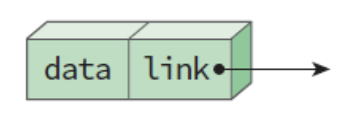
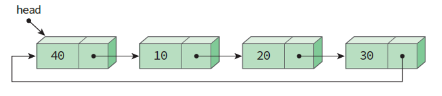
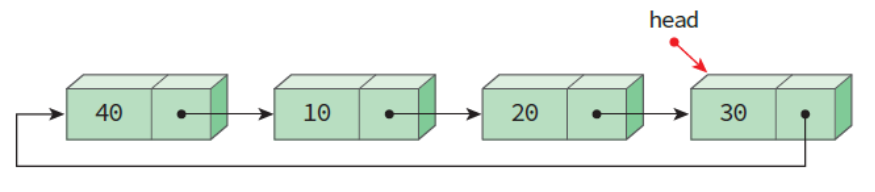
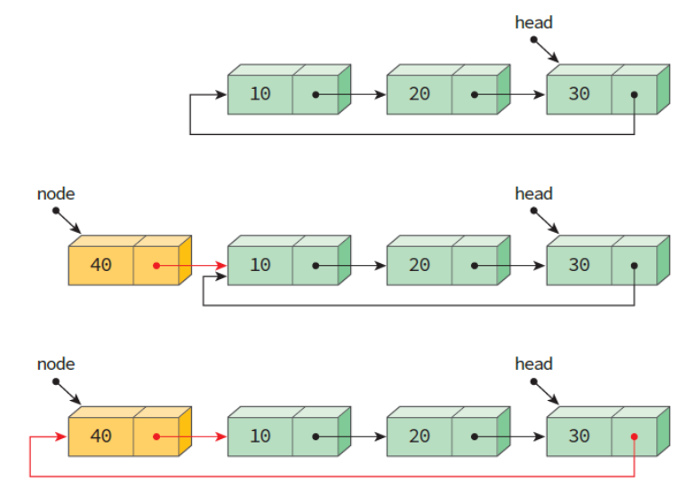
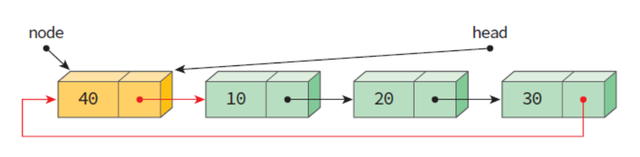
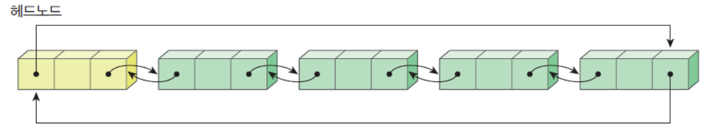

# 원형 연결 리스트 (Circular Linked List)

## 원형 연결 리스트란 무엇인가?
>원형 연결 리스트는 연결 리스트의 모든 노드가 연결되어 있어 사이클을 형성하는 특별한 자료구조다.

보통의 연결 리스트의 종단점이 NULL 포인터를 가리키는 것과 달리 원형 연결 리스트의 종단점은 헤더 노드를 가리킨다.

### 리스트의 구조
```cpp
// Node structure
struct Node {
    int data;
    Node* next;
  
    Node(int value){
        data = value;
        next = nullptr;
    }
};
```
<p align="center">
    </img>
</p>

### 두 종류의 원형 연결 리스트
***

> 원형 연결 리스트에는 단순 연결 리스트 방식과 이중 연결 리스트 방식이 있다.

### 1. 단순 연결 리스트 방식

>리스트를 구성하는 각 노드는 다음 노드를 가리키는 하나의 포인터만 갖는다.

종단점의 포인터는 다시 처음 노드를 가리키면서 리스트 전체가 순환 구조를 만든다.
단방향 순회만 가능하다

#### 1-1. 단순 원형 연결 리스트 구조

```cpp
// Initilize and allocate memory for nodes
first = new Node(40);
second = new Node(10);
third = new Node(20);
last = new Node(30);

// Connect nodes
first->next = second;
second->next = third;
third->next = last

// Connect last node to first node
last->next = first;
```
<p align="center">
    </img>
</p>

#### 1-2. 원형 연결 리스트의 헤드 포인터

위의 원형 연결 리스트에서는 헤드 포인터가 시작점 즉, `첫 번째 노드`를 가리키고 있다.

연결 리스트의 처음에 새로운 노드를 삽입을 하게 되면, 삽입을 한 후 마지막 노드까지 순회한 후 마지막 노드의 포인터를 새로운 노드르 가리키도록 수정한다.

만약 연결 리스트의 끝에 삽입을 하게 되면, 마지막 노드까지 순회한 후 새로운 노드를 삽입한다.

<u>위의 두 경우 모두 삽입을 위해 전체 리스트를 순회해야 한다.</u>

<p align="center">
    </img>
</p>

위의 원형 연결 리스트에서는 헤드 포인터를 `마지막 노드`를 가리키도록 했다. 

헤드 포인터는 마지막 노드의 주소를 갖는 동시에, 마지막 노드의 포인터가 첫 번째 노드의 주소를 갖고 있다.

때문에 연결 리스트의 처음과 끝에 새로운 노드를 삽입할 때 순회할 필요 없이 바로 가능하게 된다.

전부 `O(1)` 시간에 삽입할 수 있다.

<리스트의 처음에 새로운 노드를 삽입하는 경우>

<p align="center">
    </img>
</p>

<리스트의 끝에 새로운 노드를 삽입하는 경우>

<p align="center">
    </img>
</p>

### 2. 이중 연결 리스트 방식

>리스트를 구성하는 각 노드는 두 개의 포인터를 갖는다.

'선행 노드'를 찾기 어려웠던 단순 원형 연결 리스트 방식의 문제점을 보완했다.

하나는 다음 노드를 가리키는 포인터, 다른 하나는 이전 노드를 가리키는 포인터이다.
이 때문에 마지막 노드가 첫 번째 노드의 주소를 가지면서 동시에 첫 번째 노드 또한 마지막 노드 주소를 갖고있다.

#### 2-1. 원형 이중 연결 리스트의 구조

```cpp
// Node structure
struct Node {
    int data;
    Node* next;
    Node* pre;
	  
    Node(int value){
        data = value;
        next = nullptr;
        pre = nullptr;
    }
};
```
<p align="center">
    </img>
</p>

## 원형 연결 리스트의 동작

- 삽입
>삽입(Insertion)은 연결 리스트에서 기본적인 연산으로, 새로운 노드를 리스트에 추가하는 작업입니다.

순환 연결 리스트의 경우, 마지막 노드를 첫 번째 노드에 연결하는 단계만 추가로 수행하면 됩니다. 아래에서 설명하는 순환 연결 리스트에서는 네 가지 방식으로 노드를 삽입할 수 있습니다.

    1. 빈 리스트에 삽입
>빈 순환 연결 리스트에 노드를 삽입하려면, 주어진 데이터로 새로운 노드를 생성하고, 해당 노드의 다음 포인터(next)를 자기 자신을 가리키도록 설정한 다음, 마지막 노드를 가리키는 포인터(last)를 이 새로운 노드를 참조하도록 업데이트합니다.

    2. 리스트의 처음에 삽입
>순환 연결 리스트의 처음에 새 노드를 삽입하려면, 먼저 새 노드를 생성하고 리스트가 비어 있는지 확인합니다. 

만약 리스트가 비어 있다면, 새 노드는 자기 자신을 가리키도록 설정합니다. 리스트가 비어 있지 않다면, 새 노드의 다음 포인터(next)를 현재 헤드 노드(last->next)를 가리키도록 설정하고, 마지막 노드의 next를 새 노드로 업데이트하여 순환 구조를 유지합니다.

    3. 리스트의 끝에 삽입

>순환 연결 리스트의 끝에 노드를 삽입하려면, 새 노드를 생성하고 리스트가 비어 있는 경우에는 그 노드가 자기 자신을 가리키도록 설정합니다.

리스트가 비어 있지 않다면, 현재 마지막 노드의 다음 포인터(next)를 새 노드로 업데이트한 다음, 마지막 노드 포인터를 새 노드로 설정하여 순환 연결 구조를 유지합니다.

    4. 리스트의 노드 사이에 삽입
>순환 연결 리스트의 특정 위치에 노드를 삽입하려면, 먼저 리스트가 비어 있는 경우나 유효하지 않은 위치에 대한 예외 상황을 처리해야 합니다.

유효한 위치인 경우에는 리스트를 순회하며 해당 위치를 찾아 포인터를 조정하여 새 노드를 삽입하고, 끝에 삽입되는 경우에는 마지막 노드 포인터도 함께 업데이트합니다.

```cpp
Node *insertAtPosition(Node *last, int data, int pos){
    if (last == nullptr){
        // If the list is empty
        if (pos != 1){
            cout << "Invalid position!" << endl;
            return last;
        }
        // Create a new node and make it point to itself
        Node *newNode = new Node(data);
        last = newNode;
        last->next = last;
        return last;
    }

    // Create a new node with the given data
    Node *newNode = new Node(data);

    // curr will point to head initially
    Node *curr = last->next;

    if (pos == 1){
        // Insert at the beginning
        newNode->next = curr;
        last->next = newNode;
        return last;
    }

    // Traverse the list to find the insertion point
    for (int i = 1; i < pos - 1; ++i) {
        curr = curr->next;
      
        // If position is out of bounds
        if (curr == last->next){
            cout << "Invalid position!" << endl;
            return last;
        }
    }
    // Insert the new node at the desired position
    newNode->next = curr->next;
    curr->next = newNode;

    // Update last if the new node is inserted at the end
    if (curr == last) last = newNode;

    return last;
}
```

- 삭제
>삭제(Deletion)는 연결 리스트에서 노드를 제거하는 작업입니다.

순환 연결 리스트에서는 삭제 후에도 리스트가 순환 구조를 유지하도록 하는 것이 가장 큰 차이점입니다. 순환 연결 리스트에서는 다음 세 가지 방식으로 노드를 삭제할 수 있습니다

    1. 첫 번째 노드 삭제

>순환 연결 리스트에서 첫 번째 노드를 삭제하려면, 먼저 리스트가 비어 있는지 또는 노드가 하나만 있는지 확인합니다.

 이러한 경우에는 해당 노드를 삭제하고 마지막 노드 포인터를 적절히 업데이트하여 처리합니다. 노드가 여러 개인 경우에는 마지막 노드의 next 포인터를 현재 헤드를 건너뛰도록 업데이트하고, 헤드 노드를 삭제한 뒤 업데이트된 마지막 노드 포인터를 반환합니다.

```cpp
// Function to delete the first node of the circular linked list
Node* deleteFirstNode(Node* last) {
    if (last == nullptr) {
        // If the list is empty
        cout << "List is empty" << endl;
        return nullptr;
    }

    Node* head = last->next;

    if (head == last) {
        // If there is only one node in the list
        delete head;
        last = nullptr;
    } else {
        // More than one node in the list
        last->next = head->next;
        delete head;
    }

    return last;
}
```


    2. 특정 노드 삭제
>순환 연결 리스트에서 특정 노드를 삭제하려면, 먼저 리스트가 비어 있는 경우와 노드가 하나뿐인 경우를 처리해야 합니다.

 그 외의 경우에는 두 개의 포인터를 사용하여 삭제할 노드를 찾고, 이전 노드의 next 포인터를 삭제 대상 노드를 건너뛰도록 업데이트한 후 해당 노드를 삭제합니다. 필요한 경우 마지막 노드 포인터도 함께 업데이트합니다.

```cpp
Node* deleteSpecificNode(Node* last, int key) {
    if (last == nullptr) {
        // If the list is empty
        cout << "List is empty, nothing to delete." << endl;
        return nullptr;
    }

    Node* curr = last->next;
    Node* prev = last;

    // If the node to be deleted is the only node in the list
    if (curr == last && curr->data == key) {
        delete curr;
        last = nullptr;
        return last;
    }

    // If the node to be deleted is the first node
    if (curr->data == key) {
        last->next = curr->next;
        delete curr;
        return last;
    }

    // Traverse the list to find the node to be deleted
    while (curr != last && curr->data != key) {
        prev = curr;
        curr = curr->next;
    }

    // If the node to be deleted is found
    if (curr->data == key) {
        prev->next = curr->next;
        if (curr == last) {
            last = prev;
        }
        delete curr;
    } else {
        // If the node to be deleted is not found
        cout << "Node with data " << key
          << " not found." << endl;
    }

    return last;
}
```

    3. 마지막 노드 삭제
>순환 연결 리스트에서 마지막 노드를 삭제하려면, 먼저 리스트가 비어 있는 경우와 노드가 하나만 있는 경우를 처리해야 합니다.

 노드가 여러 개인 경우에는 두 번째로 마지막 노드를 찾기 위해 리스트를 순회하고, 그 노드의 next 포인터를 헤드로 업데이트한 후 마지막 노드를 삭제합니다. 이후 업데이트된 마지막 노드 포인터를 반환합니다.


```cpp
// Function to delete the last node in the circular linked list
Node* deleteLastNode(Node* last) {
    if (last == nullptr) {
        // If the list is empty
        cout << "List is empty, nothing to delete." << endl;
        return nullptr;
    }
    Node* head = last->next;

    // If there is only one node in the list
    if (head == last) {
        delete last;
        last = nullptr;
        return last;
    }
    // Traverse the list to find the second last node
    Node* curr = head;
    while (curr->next != last) {
        curr = curr->next;
    }
    // Update the second last node's next pointer
    // to point to head
    curr->next = head;
    delete last;
    last = curr;

    return last;
}
```
- 탐색
>순환 연결 리스트에서의 탐색은 일반 연결 리스트에서의 탐색과 유사합니다.

 주어진 노드에서 시작하여 리스트를 순회하면서 원하는 값을 찾거나 시작 지점으로 다시 돌아올 때까지 탐색을 진행합니다. 리스트가 순환 구조이므로, **무한 루프를 방지하기 위해 시작 위치를 추적하는 것이 중요합니다.**


## 정리

#### 원형 연결 리스트의 장점
- 원형 연결 리스트에서는 **마지막 노드가 첫 번째 노드를 가리킨다**.  
  따라서 `null` 참조가 존재하지 않으며, **순회(traversal)가 더 쉽고 null 포인터 예외가 발생할 가능성이 줄어든다**.

- 리스트를 **어떤 노드에서든 시작하여 다시 그 노드로 돌아올 수 있기 때문에**, 항상 헤드 노드에서 시작할 필요가 없다.  
  이는 **순환(iteration)이 필요한 응용 프로그램**에서 유용하게 쓰인다.

- 원형 연결 리스트는 **원형 큐(circular queue)** 구현에 용이하다.  
  마지막 요소가 첫 요소와 연결되므로 **효율적인 자원 관리**가 가능하다.

- 원형 연결 리스트의 각 노드는 다음 노드에 대한 참조를 가지고 있지만, 이중 연결 리스트처럼 직접적으로 이전 노드를 참조하지는 않는다.  
  그러나 **리스트를 순회함으로써 이전 노드를 찾는 것은 여전히 가능하다**.

#### 원형 연결 리스트의 단점

- 원형 연결 리스트는 단일 연결 리스트보다 구현이 더 복잡하다.

- 명확한 종료 조건 없이 원형 연결 리스트를 순회하면, 주의하지 않으면 무한 루프에 빠질 수 있다.

- 순환 구조 때문에 디버깅이 더 어렵고, 전통적인 연결 리스트 순회 방식이 적용되지 않을 수 있다.

## 응용 분야
- 시간 분할 방식의 운영체제에서 사용되며, 일반적으로 라운드 로빈(Round-Robin) 스케줄링 메커니즘을 통해 여러 사용자 간의 시간 공유를 가능하게 합니다.

- 멀티플레이어 게임에서는 순환 연결 리스트를 사용하여 플레이어 간에 턴을 전환합니다. 마지막 플레이어의 턴이 끝나면, 리스트는 다시 첫 번째 플레이어로 순환됩니다.

- 순환 연결 리스트는 스트리밍 데이터처럼 데이터가 지속적으로 생성되고 소비되는 버퍼링 애플리케이션에 자주 사용됩니다.

- 미디어 플레이어에서는 순환 연결 리스트를 사용하여 재생 목록을 관리할 수 있으며, 이를 통해 사용자가 노래를 반복해서 들을 수 있도록 합니다.

- 브라우저는 캐시를 관리할 때 순환 연결 리스트를 사용합니다. 이를 통해 사용자가 '뒤로 가기' 버튼을 눌러 방문 기록을 효율적으로 탐색할 수 있습니다.


## 참고 문헌
[Circular Linked List](https://www.geeksforgeeks.org/circular-linked-list/)
