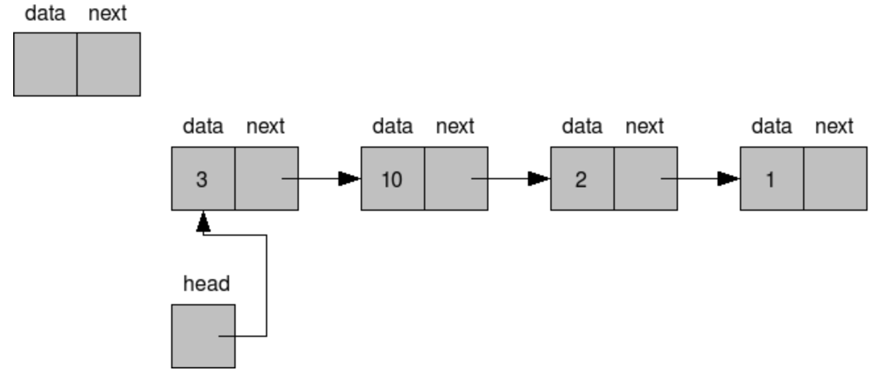

# 📚 목차

이 장에서는 linked list의 개념, 원리, 그리고 실제 적용 예제를 중심으로 학습한다.

## 주요 키워드

| 항목                   | 설명                             |
| ---------------------- | -------------------------------- |
| [정의](#one)           | 핵심 개념 및 원리 요약           |
| [단순연결리스트](#two) | 단순연결리스트 개념 및 구현 코드 |
| [구현](#three)         | 파이썬에서의 구현                |

---

## 정의 <a href="#one" id="one"></a>

> 데이터를 저장할 때 하나의 데이터와 그 다음 데이터로의 위치(보통 다음 노드의 주소나 참조)를 함께 저장하여 논리적으로 연결하는 자료 저장 방식

노드는 데이터필드와 링크필드를 가지는 구조체로 정의한다. 리스트 생성함수는 헤드노드를 만든 후 노드를 가리키는 포인터를 리턴한다. 포인터는 리스트를 가리키는 포인터이고 포인터가 가리키는 노드는 헤드노드로 이후 연산의 편의성을 위해 포인터가 바로 데이터를 가지는 노드가 아닌 빈 노드를 가리키게 만든다.

**장점**
배열은 한 번 선언하면 그 크기를 더 이상 늘리기 어렵다. 이에 비해 연결 리스트는 노드를 추가해 주면 배열에 비해 데이터의 추가/삽입 및 삭제가 매우 용이하다. 전체 크기를 늘리고 줄이는 것 또한 가능해진다.

**단점**
데이터와 다음 노드의 주소 둘 다 담고 있어야 하니 기본적인 데이터의 단위가 커진다. 또한 배열은 자료마다 번호가 있어서 특정한 자료를 불러내기가 편리한 반면, 연결 리스트는 자료 번호가 없이 연결 관계만 있기 때문에 노드를 하나하나 순차적으로 탐색하지 않으면 특정 위치의 요소에 접근할 수 없어 일반적으로 탐색 속도가 떨어진다.

즉, 탐색 또는 정렬을 자주 하면 배열을, 추가/삭제가 많으면 연결 리스트를 사용하는 것이 유리하다.

---

## 단순 연결 리스트 (signly linked list) <a href="#two" id="two"></a>



> 다음 노드에 대한 참조만을 가진 가장 단순한 형태의 연결 리스트

다음 노드에 대한 참조만을 가진 가장 단순한 형태의 연결 리스트이다. 가장 마지막 원소를 찾으려면 리스트 끝까지 찾아가야 하기 때문에(O(n)), 마지막 원소를 가리키는 참조를 따로 가지는 형태의 변형도 있다. 보통 큐 (queue)를 구현할 때 이런 방법을 쓴다.

head 노드(첫 번째 데이터 노드)를 참조하는 주소를 잃어버릴 경우 데이터 전체를 못 쓰게 되는 단점이 있다. 다음 노드를 참조하는 주소 중 하나가 잘못되는 경우에도 해당 부분부터 뒤쪽 자료들을 유실한다. 따라서 안정적인 자료 구조는 아니다.

**삽입**
노드 1과 2 사이에 4라는 새로운 노드를 삽입하려고 한다.
4의 Link는 2를 가리키게 하고, 1의 Link는 4를 가리키게 하면 된다.

**삭제**
노드 4를 삭제할 때는 노드 1의 Link가 2를 가리키게 하면 된다. 그렇게 하면 노드 4를 가리키는 어떤 노드도 없기 때문에 가비지 컬렉션(Garbage collection)에 의해 자동으로 삭제된다.

---

## 파이썬에서의 구현 <a href="#three" id="three"></a>

파이썬은 모든 것이 객체이며, 변수는 객체를 참조한다. 이 덕분에 파이썬에서는 객체 지향 방식으로 연결 리스트를 비교적 쉽게 구현할 수 있다.

먼저, 각 노드를 표현하는 Node 클래스를 정의한다.

```python
# Python
class Node:
    def __init__(self, data):
        self.data = data  #data는 값을 가리키는 변수
        self.next = None  #next는 다음 노드를 가리키는 변수

```

연결 리스트를 만들 때는 첫 번째 노드에 head라는 이름표를 붙여 시작한다.

첫 번째 노드를 만들고 head에 할당한다.
두 번째 노드를 만들고, head.next가 두 번째 노드를 가리키도록 한다.
세 번째 노드를 만들고, head.next.next가 세 번째 노드를 가리키도록 한다.

```python
# Python
class Node:
    def __init__(self, data):
        self.data = data  #data는 값을 가리키는 변수
        self.next = None  #next는 다음 노드를 가리키는 변수

head = Node(1)
head.next = Node(2)
head.next.next = Node(3)
```

연결리스트는 head부터 마지막 노드까지 이동하며 data를 출력한다.

이때 head는 연결 리스트의 시작이므로, head가 이동하면 연결 리스트를 잃게 된다. 따라서 변수(이름표)를 만들고 head부터 마지막 노드까지 이동하면서 data를 출력한다.

마지막 노드의 next는 None을 가리키므로, 노드가 None이 아닐 동안 계속 이동하면서 data를 출력한다.

```python
# Python
node = head
while node:
    print(node.data, end = " ")
    node = node.next

```

실행 결과는 다음과 같다.

```python
1 2 3
```

단순 연결 리스트의 끝에 새 노드를 아래처럼 추가할 수 있다.

```python
node = head
while node.next:  # 현재 노드의 next가 None이 아닐 동안 실행
    node = node.next
node.next = Node(4)
```

변수를 만들고 head부터 마지막 노드까지 이동한다.
마지막 노드의 next가 새 노드를 가리키도록 한다. (next에 새 노드를 할당)

연결 리스트의처음에 새 노드를 추가할 수도 있다.

첫 노드인 head 앞에 노드를 추가할 때, 연결 리스트의 연결이 끊어지지 않도록 세 단계로 나눠서 노드를 추가한다.

1. 추가할 노드를 생성한다.
2. 추가할 노드의 next가 head를 가리키게 한다.
3. head를 추가한 노드로 옮긴다.

```python
node = Node(0)
node.next = head
head = node
```

---

## 참고

- **참고한 자료**

  - [위키백과 - 연결리스트](https://namu.wiki/w/%EC%97%B0%EA%B2%B0%20%EB%A6%AC%EC%8A%A4%ED%8A%B8)
  - 생활코딩의 [Linked list 개념](youtube.com/watch?time_continue=510&v=sq49IpxBl2k&embeds_referring_euri=https%3A%2F%2Fopentutorials.org%2F&source_ve_path=MjM4NTE)
  - [좌충우돌, 파이썬으로 자료구조 구현하기](https://wikidocs.net/224937)

- **이미지 출처**
  - [Wikimedia Commons](https://commons.wikimedia.org/wiki/File:C_language_linked_list_adding_a_link_step_1.png)
