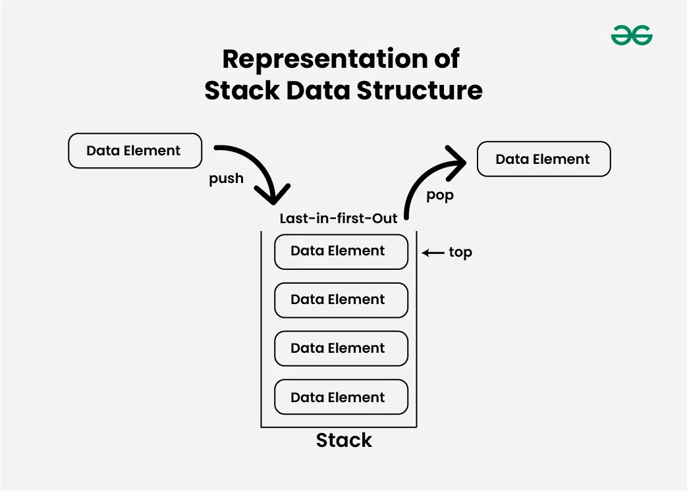
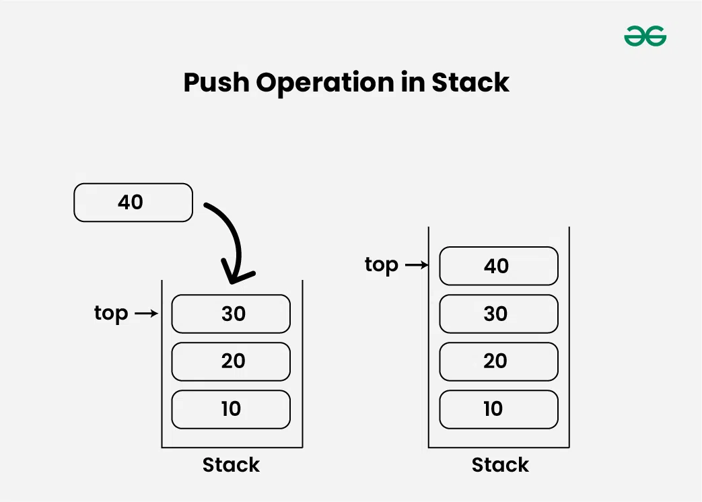
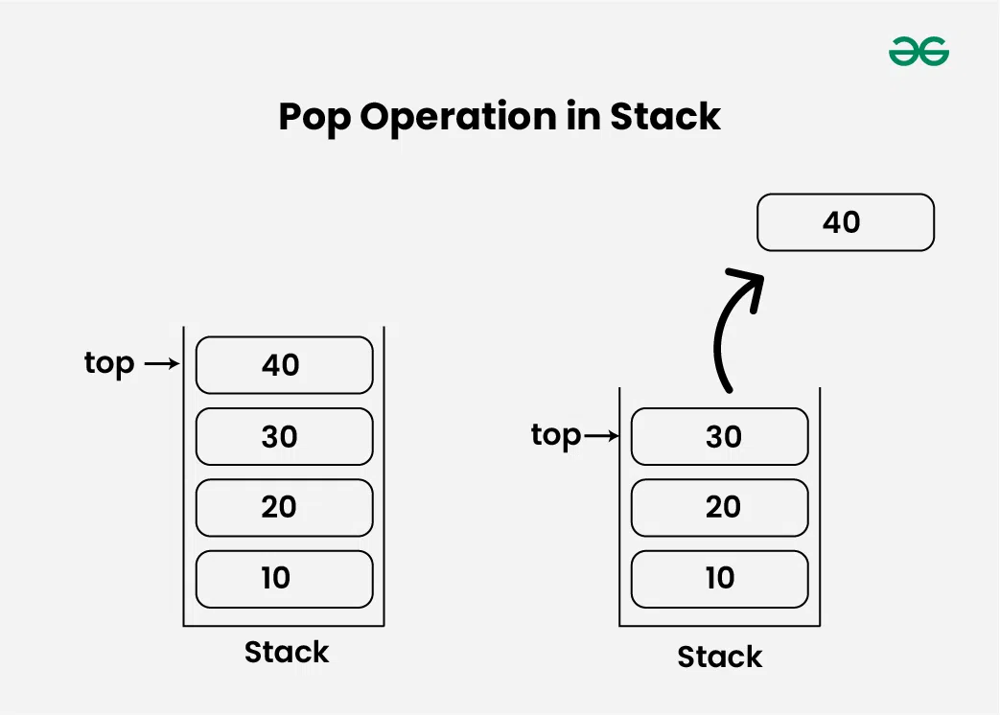
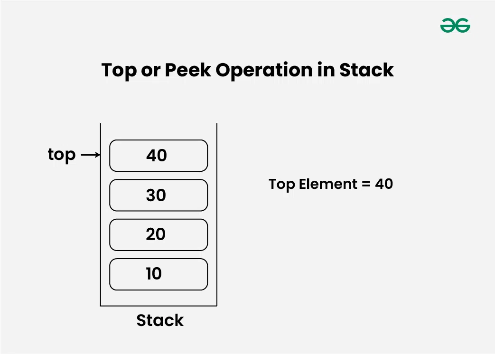
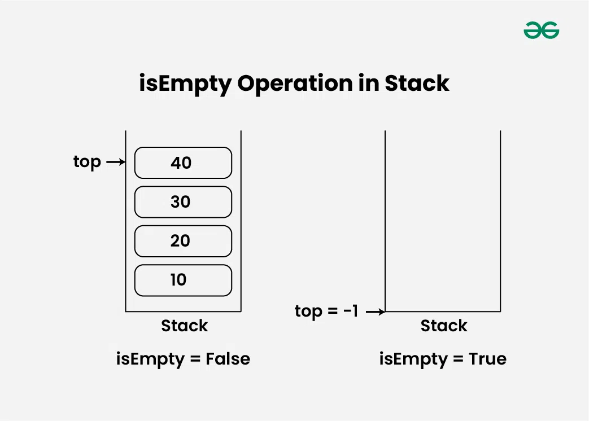
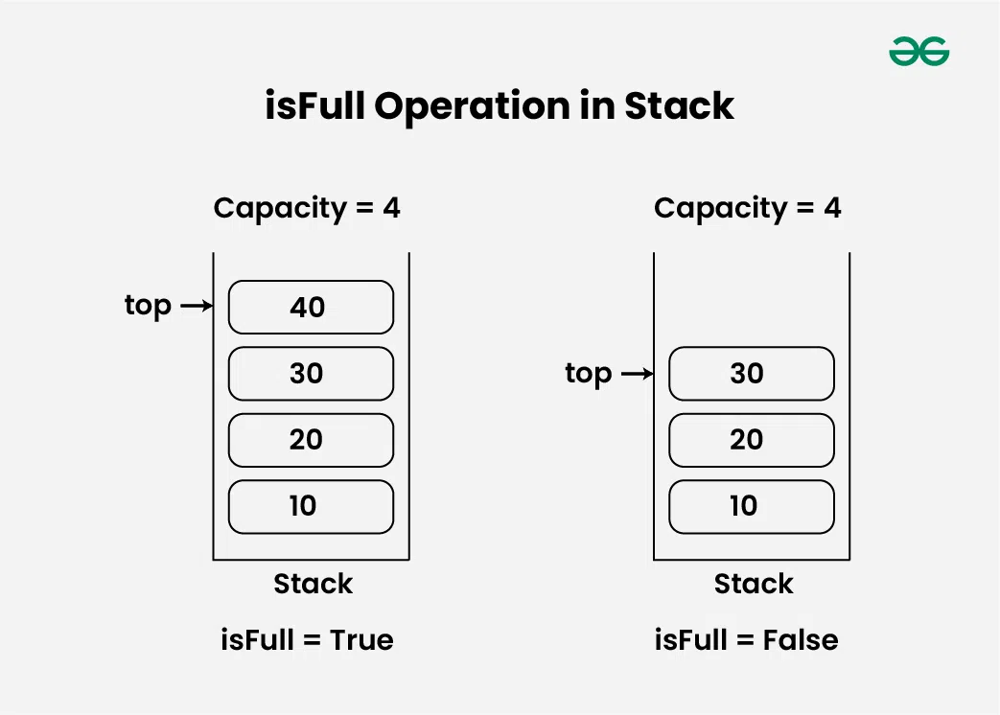

# 스택(STACK)

이 장에서는 스택 자료구조의 개념, 원리, 그리고 실제 적용 예제를 중심으로 학습한다.

> 스택의 핵심 개념, 기본 연산, 시간복잡도 등을 중심으로 학습할 수 있다.

## 주요 키워드

| 항목           | 설명 |
|----------------|------|
| [스택 정의](#스택stack) | LIFO(후입선출) 원칙을 따르는 선형 자료구조로, 삽입과 삭제가 한쪽 끝(top)에서만 수행된다. |
| [스택 종류](#스택의-종류) | 고정 크기 스택 (배열 기반), 동적 크기 스택 (연결 리스트 기반 또는 리스트 기반) |
| [기본 연산](#스택의-기본-연산) | `push()`, `pop()`, `peek()` 또는 `top()`, `isEmpty()`, `isFull()` |
| [코드 구현](#스택-구현) | Python 리스트를 사용하여 스택 구현 |
| [시간복잡도](#스택-시간복잡도--공간복잡도) | 대부분의 연산은 O(1) 시간복잡도를 가진다. |
| [참고](#참고) | 관련 링크 및 이미지 출처 등 |


# 스택(STACK)

 스택은 LIFO(Last In First Out) 원칙을 따르는 선형 자료 구조로, 마지막으로 삽입된 요소가 가장 먼저 꺼내진다. 즉, 삽입과 삭제가 한쪽 끝에서만 수행된다.

 📌 접시를 쌓아두는 곳을 떠올려 보면, 새로운 접시는 스택의 맨 위에 놓이고, 사용할 때는 맨 위의 접시부터 꺼내게 된다.

## 스택의 종류

### 고정 크기 스택 (Fixed-size Stack)

- **설명**: 스택의 크기가 정해져 있어 초과할 수 없다. 주로 배열로 구현된다.
- **장점**:  
  - 메모리 사용량이 예측 가능  
  - 오버플로우 감지 용이  
- **단점**:  
  - 크기 초과 시 Stack Overflow 발생  
  - 메모리 낭비 가능성 존재 (최대치보다 적게 사용하는 경우)
- **예시**:  
  - 함수 호출 스택  
  - 임베디드 시스템에서의 연산  
  - 고정 입력 길이를 가진 문자열 뒤집기

---

### 동적 크기 스택 (Dynamic-size Stack)

- **설명**: 필요에 따라 크기를 유동적으로 조절하는 스택. 주로 리스트나 연결 리스트로 구현된다.
- **장점**:  
  - 크기 제한 없이 데이터 삽입 가능  
  - 메모리 낭비가 적음  
- **단점**:  
  - 구현이 약간 더 복잡  
  - 메모리 재할당 오버헤드 가능성
- **예시**:  
  - 대부분의 현대 프로그래밍 언어의 기본 리스트(stack)  
  - 동적 수식 계산기  
  - DFS 탐색 경로 저장 등


## 스택의 기본 연산
1. __push()__ : 스택의 맨 위에 항목 추가

2. __pop()__ : 맨 위 항목 제거 및 반환

3. __peek()__ / top() : 맨 위 항목 조회 (제거 X)

4. __isEmpty()__ : 비어 있는지 확인

5. __isFull()__ : 가득 찼는지 확인

## 스택의 push 연산
- 스택이 가득 찼는지 확인

- 가득 찼다면 오버플로우 발생

- 그렇지 않으면 top += 1 하고 새로운 요소 삽입


## 스택의 pop 연산
스택에서 항목을 제거한다. 항목은 항목은 push된 순서의 역순으로 pop된다. 스택이 비어 있으면 언더 플로우(Underflow)상태라고 한다.
  
  - 스택에서 요소를 pop하기 전에 스택이 비어 있는지 확인한다.
- 스택이 비어 있으면 (top == -1)Stack Underflow가 발생하고 스택에서 어떤 요소도 제거할 수 없다.
- 그렇지 않으면, top에 값을 저장하고, top의 값을 1감소시킨 후 (top = top-1) 저장된 top 값을 반환한다.


## 스택의 top 또는 peek 연산
스택의 맨 위 요소를 반환한다.

- 스택의 맨 위 요소를 반환하기 전에 스택이 비어 있는지 확인한다.
- 스택이 비어 있으면 (top == -1) ”스택이 비어 있습니다” 라고 출력한다.
- 그렇지 않으면 index == top 에 저장된 요소를 반환한다.


## 스택의 isEmpty 연산
  스택이 비어 있으면 true를 반환하고, 그렇지 않으면 false를 반환한다.

- 스택에서 top의 값을 확인한다.
- (top == -1) 이면 스택이 비어 있으므로 true를 반환한다.
- 그렇지 않으면 스택이 비어 있지 않으므로 false를 반환한다.


## 스택의 isFull 연산
스택이 가득 차면 true를 반환하고, 그렇지 않으면 false를 반환한다. 

- 스택에서 top의 값을 확인한다.
- (top == capacity-1)이면 스택이 가득 찼으므로 true를 반환한다.
- 그렇지 않으면 스택이 가득 차지 않았으므로 false를 반환한다.


## 스택 구현

```python
# 파이썬 리스트를 이용한 스택 구현
class Stack:
    def __init__(self):
        self.data = []  # 스택 저장용 리스트

    def is_empty(self):
        # 스택이 비었는지 확인
        return len(self.data) == 0

    def push(self, value):
        # 스택에 값 추가 (top에 추가)
        self.data.append(value)
        print(f"Pushed: {value}")

    def pop(self):
        # 스택에서 top 요소 제거 및 반환
        if self.is_empty():
            print("Stack Underflow: 스택이 비어 있습니다.")
            return -1  # 오류 표시
        return self.data.pop()

    def peek(self):
        # 현재 스택의 top 요소 반환 (제거 X)
        if self.is_empty():
            print("스택이 비어 있습니다.")
            return -1
        return self.data[-1]

# 스택 동작 테스트
if __name__ == "__main__":
    s = Stack()  # 스택 생성

    # push 연산 테스트
    s.push(10)
    s.push(20)
    s.push(30)

    # peek 연산: 현재 top 확인
    print("Top:", s.peek())

    # pop 연산 테스트
    print("Popped:", s.pop())
    print("Popped:", s.pop())
    print("Popped:", s.pop())

    # 빈 스택에서 pop 시도 (underflow)
    print("Popped:", s.pop())
```


## 스택 시간복잡도 / 공간복잡도

| 연산           | 시간복잡도 | 공간복잡도 |
|----------------|------------|------------|
| `push()`       | O(1)       | O(1)       |
| `pop()`        | O(1)       | O(1)       |
| `peek()`/`top()` | O(1)     | O(1)       |
| `isEmpty()`    | O(1)       | O(1)       |
| `isFull()`     | O(1)       | O(1)       |
| 전체 순회      | O(n)       | O(1)       |

## 참고
- 참고한 자료
  - [GeeksforGeeks의 Stack Tutorial](https://www.geeksforgeeks.org/introduction-to-stack-data-structure-and-algorithm-tutorials/)
- 이미지 출처
  - https://www.geeksforgeeks.org/stack-data-structure/
