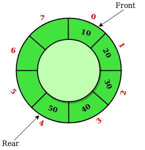
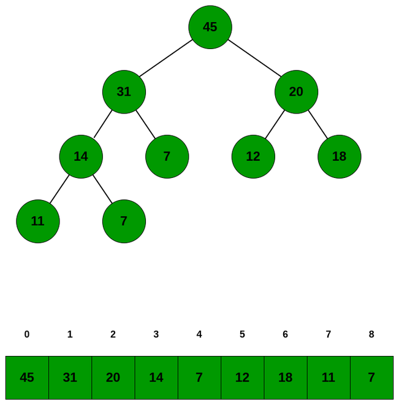
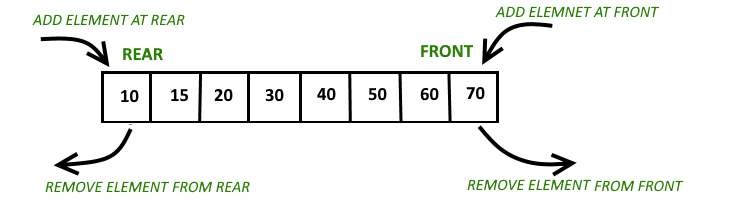

# 📚 목차

- [큐 (Queue)란?](#큐-queue)
- [큐의 종류](#큐의-종류)
  - [1. 일반 큐](#1-일반-큐-queue)
  - [2. 원형 큐](#2-원형-큐-circular-queue)
  - [3. 우선순위 큐](#3-우선순위-큐-priority-queue)
    - [힙(Heap)이란?](#힙heap이란)
  - [4. 덱 (Deque)](#4-덱-double-ended-queue)
- [큐의 기본 연산](#큐의-기본-연산)
- [큐의 실제 활용 사례](#큐의-실제-활용-사례)
- [큐 자료구조 구현 코드](#큐queue-자료구조-구현코드)
- [큐의 시간 복잡도 / 공간 복잡도](#큐의-시간-복잡도--공간-복잡도)
- [Quiz](#quiz)
- [총 정리](#총-정리)
- [References](#references)

<hr/>


# 큐 (Queue)  


큐(Queue)는 **선입선출(FIFO)** 방식의 자료구조이다. 마치 놀이기구의 줄을 서서 기다리는 상황처럼, 먼저 들어온 데이터가 먼저 처리된다.

큐에서 핵심 개념은 다음과 같다.

- **Front (head)**: 가장 먼저 들어온 데이터를 가리키며, 삭제 연산은 이 지점을 기준으로 수행된다.

- **Rear (tail)**: 가장 나중에 들어온 데이터를 가리키며, 삽입 연산은 이 지점에서 일어난다.

- 이 두 포인터를 적절히 관리하면 큐의 삽입과 삭제 연산을 **O(1)**의 시간 복잡도로 처리할 수 있다.

- **배열**, **연결 리스트**로 구현 가능하다.

# 큐의 종류

큐를 **기능/동작별**로 구분하면 다음과 같다.

## 1. 일반 큐 (Queue)

    배열이나 연결 리스트로 구현할 수 있다.
    배열을 사용하면 고정 크기의 큐가 되고, 연결 리스트를 사용하면 동적 크기 큐가 된다.

## 2. 원형 큐 (Circular Queue)



    보통 배열로 구현하고,배열을 순환 구조로 사용하여 공간 낭비 최소화한다.

## 3. 우선순위 큐 (Priority Queue)



우선순위 큐는 요소마다 우선순위를 부여하고, 그 우선순위에 따라 요소를 꺼내는 자료구조다. 일반 큐는 들어온 순서대로 처리하지만, 우선순위 큐는 우선순위가 높은 요소를 먼저 처리한다.

우선순위 큐는 주로 **힙(Heap)** 구조를 이용해 효율적으로 구현된다.

### 힙(Heap)이란?
힙은 완전 이진 트리 기반의 자료구조이며, 크게 두 가지 종류가 있다:

1. 최소 힙(Min Heap): 부모 노드 ≤ 자식 노드

2. 최대 힙(Max Heap): 부모 노드 ≥ 자식 노드

우선순위 큐에서는 **가장 높은 우선순위의 원소**를 먼저 꺼내면 된다.


## 4. 덱 (Double-Ended Queue)



큐의 앞(front)과 뒤(rear) 양쪽 모두에서 삽입과 삭제가 가능한 자료구조이다.

즉, **큐**와 **스택**의 특징을 모두 가지고 있어 다음과 같은 동작들이 가능하다:

- 앞에서 삽입 (push_front)

- 앞에서 삭제 (pop_front)

- 뒤에서 삽입 (push_back)

- 뒤에서 삭제 (pop_back)

# 큐의 기본 연산

| 연산        | 설명                         |
| --------- | -------------------------- |
| `enqueue` | 큐의 뒤쪽(Rear)에 요소를 삽입        |
| `dequeue` | 큐의 앞쪽(Front)에서 요소를 제거 및 반환 |
| `peek`    | 큐의 앞쪽 요소를 반환하되 제거하지 않음     |
| `isEmpty` | 큐가 비어 있는지 확인               |
| `size`    | 큐에 포함된 요소의 개수를 반환          |

# 큐의 실제 활용 사례

큐는 FIFO 구조를 기반으로 하기 때문에,
'순서대로' 데이터를 처리해야 하는 문제에서 강력한 도구로 사용된다.

- 운영체제: 작업 스케줄러, 인터럽트 처리

- 네트워크: 패킷 큐, 요청 처리 순서 유지

- 알고리즘: **BFS** 


# 큐(Queue) 자료구조 구현코드

```C
#include <stdio.h>
#include <stdlib.h>
#define SIZE 100

typedef struct {
    int data[SIZE];
    int front;
    int rear;
} Queue;

// 초기화
void initQueue(Queue* q) {
    q->front = 0;
    q->rear = 0;
}

// 비었는지 확인
int isEmpty(Queue* q) {
    return q->front == q->rear;
}

// 가득 찼는지 확인
int isFull(Queue* q) {
    return q->rear == SIZE;
}

// 삽입
void enqueue(Queue* q, int value) {
    if (isFull(q)) {
        printf("큐가 가득 찼습니다.\n");
        return;
    }
    q->data[q->rear++] = value;
}

// 삭제
int dequeue(Queue* q) {
    if (isEmpty(q)) {
        printf("큐가 비었습니다.\n");
        return -1;
    }
    return q->data[q->front++];
}

// 맨 앞값 확인
int peek(Queue* q) {
    if (isEmpty(q)) {
        printf("큐가 비었습니다.\n");
        return -1;
    }
    return q->data[q->front];
}

// 사용 예시
int main() {
    Queue q;
    initQueue(&q);

    enqueue(&q, 10);
    enqueue(&q, 20);
    enqueue(&q, 30);

    printf("맨 앞 값: %d\n", peek(&q));     // 10
    printf("꺼낸 값: %d\n", dequeue(&q));   // 10
    printf("다음 값: %d\n", peek(&q));     // 20

    return 0;
}

```

# 큐의 시간 복잡도 / 공간 복잡도

## 시간 복잡도

| 연산        | 시간복잡도 (일반 큐 구현 기준) |
| --------- | ------------------ |
| `enqueue` | O(1)               |
| `dequeue` | O(1)               |
| `peek`    | O(1)               |
| `isEmpty` | O(1)               |

## 공간 복잡도

| 큐 종류 | 구현 방식  | 공간 복잡도 | 설명                        |
| ---- | ------ | ------ | ------------------------- |
| 일반 큐 | 배열     | O(N)   | N개의 요소 저장을 위한 고정 크기 배열 사용 |
|      | 연결 리스트 | O(N)   | N개의 노드 + 포인터 공간 필요        |
| 원형 큐 | 배열     | O(N)   | 배열 전체를 재활용하여 고정 크기 유지     |


# Quiz 

### 1. 왜 원형 큐는 연결 리스트로 잘 안쓰일까?

연결 리스트로 원형 큐를 구현하려면 마지막 노드의 next가 첫 노드를 가리켜야 한다. 그렇게 되면 삽입/삭제 로직도 더 복잡해지고, 포인터 관리도 힘들어진다.

### 2.다음 조건을 만족하는 enqueue() 함수만 구현하시오.
조건:
```
- 최대 100개의 정수를 저장하는 큐

- 전역 변수로 int queue[100];, int rear = 0; 사용

- **enqueue(int x)**를 호출하면 큐 뒤에 정수를 추가
```

함수의 형태는 다음과 같다:
```C
void enqueue(int x) {
    // 여기에 코드 작성
}

```


정답:
```C
#define SIZE 100

int queue[SIZE];
int rear = 0;

void enqueue(int x) {
    if (rear >= SIZE) {
        printf("큐가 가득 찼습니다.\n");
        return;
    }
    queue[rear++] = x;
}


```

# 총 정리 

큐는 다양한 컴퓨팅 환경에서 "처리 순서"를 제어하는 데 핵심적인 자료구조다.예를 들어, 운영체제의 작업 스케줄러, 프린터 대기열, 네트워크 패킷 처리, 그리고 BFS 같은 알고리즘 문제에서도 큐는 핵심 도구로 사용된다.따라서 알고리즘 문제나 실제 시스템 설계 시 큐의 개념을 정확히 이해하고 있어야 한다.


# References
-https://www.geeksforgeeks.org/queue-data-structure/ 

-https://en.wikipedia.org/wiki/Queue_(abstract_data_type)