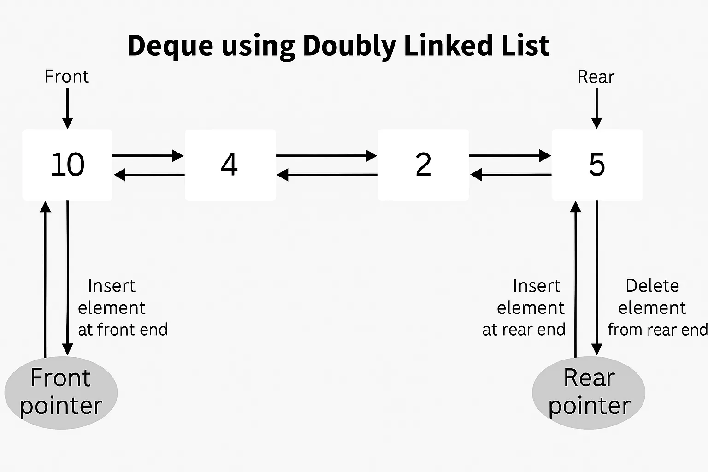
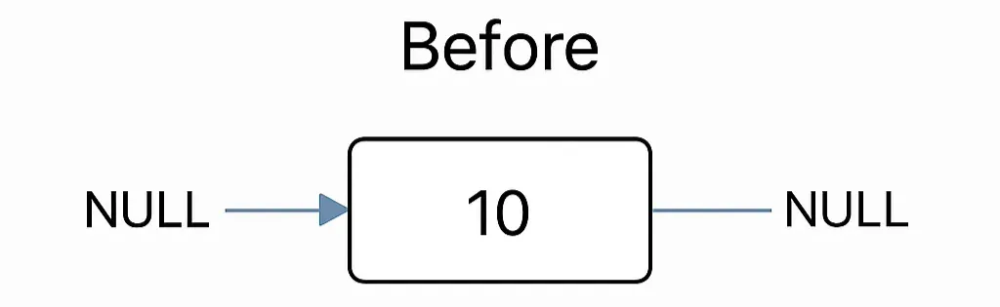
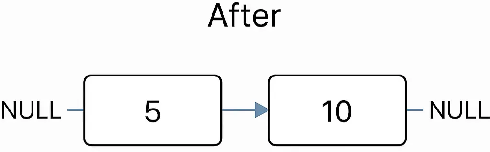

# 🚥링크드 덱(Linked-Deque)

## 연결된 덱의 구현

 ### 💡덱(Deque)은 
스택이나 큐처럼 연결 리스트로 구현할 수 있지만, 양쪽 끝에서 삽입과 삭제가 가능하다는 특성 때문에 구현이 다소 복잡하다.
<br>스택이나 큐와 다르게 덱은 전단과 후단에서 모두 삽입과 삭제가 가능하기 때문에, 하나의 노드에서 알아야 할 정보가 더 많을 수밖에 없다. 
<br>예를 들면, 선행 노드와 후속 노드를 가리키는 포인터 변수를 써야 한다. 이런 구조를 **이중 연결 리스트(doubly linked list)**라고 부른다.
<br>이러한 이유로 덱은 일반적으로 이중 연결 리스트를 사용해 구현한다.

---

## 🔷 이중 연결 리스트(Doubly-Linked List)를 이용한 덱(Deque) 구현

### ✅ 덱(Deque)이란?

앞서 덱의 개념을 다뤘지만, 구현에 앞서 핵심 개념을 다시 간단히 다시 살펴 보겠다.

Deque(덱, Double-Ended Queue)는 **양쪽 끝에서 삽입과 삭제가 가능한 큐**이다. 덱은 다음 두 가지 방식으로 구현될 수 있다:

1. **입력 제한 덱(Input Restricted Deque)**: 한쪽에서만 삽입 가능, 양쪽에서 삭제 가능
2. **출력 제한 덱(Output Restricted Deque)**: 양쪽에서 삽입 가능, 한쪽에서만 삭제 가능

---

## 🧱 이중 연결 리스트 구조

이중 연결 리스트를 사용하면 덱에서 앞과 뒤 양쪽에서의 삽입/삭제를 **O(1)** 시간에 구현할 수 있다.

```c
// 노드 구조체 정의
typedef struct Node {
    int data;
    struct Node* prev;
    struct Node* next;
} Node;

// 덱 구조체 정의
typedef struct {
    Node* front;
    Node* rear;
    int size;
} Deque;
```

---

## 🧰 덱에서 관리되는 주요 포인터

- `front`: 덱의 가장 앞 노드를 가리킴
- `rear`: 덱의 가장 뒤 노드를 가리킴

두 포인터 모두 `Deque` 구조체 내부에 포함되어 있음

---

## 🖼️ 덱 구조 전체 흐름도

> 💡 본격적인 구현 함수 설명에 앞서, 덱이 이중 연결 리스트로 구성될 때 구조가 어떻게 되는지 아래 그림에서 설명하고 있다.



### ✅ 전단(Front) 연산

- **삽입**: 새 노드를 기존 `front` 앞에 붙이고 → `front` 포인터를 새 노드로 이동
- **삭제**: 기존 `front` 노드를 제거하고 → 다음 노드를 `front`로 이동

---

### ✅ 후단(Rear) 연산

- **삽입**: 새 노드를 기존 `rear` 뒤에 붙이고 → `rear` 포인터를 새 노드로 이동
- **삭제**: 기존 `rear` 노드를 제거하고 → 이전 노드를 `rear`로 이동

---

## 🧩 덱의 주요 연산들

### 🔹 createDeque()

덱(Deque) 구조체를 동적으로 생성하고 초기화한다.

```c
Deque* createDeque() {
    Deque* dq = (Deque*)malloc(sizeof(Deque));
    if (!dq) {
        printf("메모리 할당 실패\n");
        exit(1);
    }
    dq->front = dq->rear = NULL;
    dq->size = 0;
    return dq;
}
```

---

### 🔹 insertFront(int data)

앞쪽에 새 노드를 삽입하는 과정은 다음과 같다:






1. 새 노드를 동적으로 생성하고 데이터를 저장한다.
2. 덱이 비어 있다면, front와 rear가 모두 이 노드를 가리키게 한다.
3. 덱이 비어 있지 않다면, 현재 front 노드 앞에 새 노드를 삽입한다.

```c
void insertFront(Deque* dq, int data) {
    Node* newNode = (Node*)malloc(sizeof(Node));
    if (!newNode) {
        printf("Overflow\n");
        return;
    }
    newNode->data = data;
    newNode->prev = NULL;
    newNode->next = dq->front;

    if (isEmpty(dq)) {
        dq->front = dq->rear = newNode;
    } else {
        dq->front->prev = newNode;
        dq->front = newNode;
    }
    dq->size++;
}
```

---

### 🔹 insertRear(int data)

```c
void insertRear(Deque* dq, int data) {
    Node* newNode = (Node*)malloc(sizeof(Node));
    if (!newNode) {
        printf("Overflow\n");
        return;
    }
    newNode->data = data;
    newNode->next = NULL;
    newNode->prev = dq->rear;

    if (isEmpty(dq)) {
        dq->front = dq->rear = newNode;
    } else {
        dq->rear->next = newNode;
        dq->rear = newNode;
    }
    dq->size++;
}
```

---

### 🔹 deleteFront()

```c
void deleteFront(Deque* dq) {
    if (isEmpty(dq)) {
        printf("Underflow\n");
        return;
    }
    Node* temp = dq->front;
    dq->front = dq->front->next;

    if (dq->front) dq->front->prev = NULL;
    else dq->rear = NULL;

    free(temp);
    dq->size--;
}
```

### 🔹 deleteRear()

```c
void deleteRear(Deque* dq) {
    if (isEmpty(dq)) {
        printf("Underflow\n");
        return;
    }
    Node* temp = dq->rear;
    dq->rear = dq->rear->prev;

    if (dq->rear) dq->rear->next = NULL;
    else dq->front = NULL;

    free(temp);
    dq->size--;
}
```

---

### 🔹 getFront / getRear

```c
int getFront(Deque* dq) {
    return isEmpty(dq) ? -1 : dq->front->data;
}

int getRear(Deque* dq) {
    return isEmpty(dq) ? -1 : dq->rear->data;
}
```

---

### 🔹 clear / free 함수

```c
void clearDeque(Deque* dq) {
    while (!isEmpty(dq)) {
        deleteFront(dq);
    }
}

void freeDeque(Deque* dq) {
    clearDeque(dq);
    free(dq);
}
```

---

### 🔹 테스트 예시

```c
int main() {
    Deque* dq = createDeque();
    insertRear(dq, 5);
    insertRear(dq, 10);
    printf("Rear: %d\n", getRear(dq));
    deleteRear(dq);
    printf("New Rear: %d\n", getRear(dq));

    insertFront(dq, 15);
    printf("Front: %d\n", getFront(dq));
    printf("Size: %d\n", getSize(dq));

    deleteFront(dq);
    printf("New Front: %d\n", getFront(dq));

    freeDeque(dq);
    return 0;
}
```

---

## ⏱️ 시간 복잡도

| 연산 | 시간 복잡도 |
| --- | --- |
| `insertFront`, `insertRear` | O(1) |
| `deleteFront`, `deleteRear` | O(1) |
| `getFront`, `getRear` | O(1) |
| `clear()` | O(n) |

---

## ⚖️ 배열 기반 덱과 연결 리스트 기반 덱 비교

| 항목 | 배열 기반 덱 | 연결 리스트 기반 덱 |
| --- | --- | --- |
| 메모리 크기 | 고정 크기 (오버플로우 가능) | 동적 크기 (유연함) |
| 삽입/삭제 시간 | O(1) *(제약 있음)* | O(1) (전단/후단 모두 가능) |
| 구현 난이도 | 비교적 단순 | 포인터 관리 필요, 복잡함 |
| 리사이징 | 필요 (재할당) | 불필요 |

---

## 🚩 덱의 활용 예시

- **브라우저 방문 기록**: 앞으로/뒤로 이동 기능 구현 시
- **텍스트 에디터의 Undo/Redo 기능**: 명령의 순서를 양방향으로 관리
- **슬라이딩 윈도우 알고리즘**: 양쪽에서 데이터 제거/추가
- **캐시 시스템 (LRU 등)**: 오래된 데이터를 전단에서 제거, 새 데이터 후단 삽입

---

## 📌 정리

| 특징 | 내용 |
| --- | --- |
| 자료구조 | 이중 연결 리스트 |
| 주요 장점 | 전단/후단 O(1) 연산 가능 |
| 단점 | 포인터 관리 복잡 |
| 활용 분야 | 브라우저 기록, Undo/Redo, LRU 등 |

---
## 사진 출처 및 참고 
- Geeks for Geeks : <a herf="https://www.geeksforgeeks.org/dsa/implementation-deque-using-doubly-linked-list/">Implementation of Deque using doubly linked list</a>