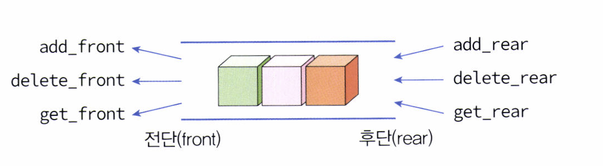
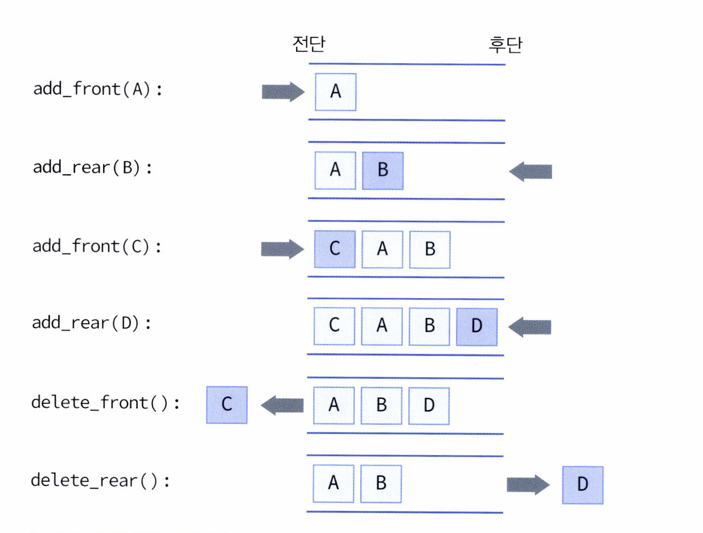

# 덱 (Deque) 

# 1. 덱 이란? 

덱, **Deque는 Double Ended Queue**의 줄임말이다. 덱은 데이터값을 저장하는 기본적인 구조로, 일차원의 선형 자료구조이다.

<div align="center">
 
 <br>
 <br>
 <sub>덱의 구조</sub>
 </div>

덱은 큐의 **전단(front)과 후단(rear)에서 모두 삽입과 삭제를 할 수 있는 큐**를 말한다. 하지만 중간에서 삽입하거나 삭제하는 것은 허용하지 않는다.

단순히 값을 삽입하고 삭제하는 용도로만 활용할 때는 `O(1)`만큼의 시간밖에 할애되지 않기 때문에 아주 효율적이다. 
<br>

>덱은 후단만 사용하면 스택이 되고, 후단에서 삽입과 전단에서 삭제 연산을 수행하면 큐가 된다. 덱은 원형 큐 (Circle Queue)를 확장하면 손쉽게 구현할 수 있는데, 원형 큐에서 플러스로 전단(front)에서의 삽입과 후단(rear)에서 삭제만 추가되면 덱을 구현할 수 있기 때문이다. 

# 2. 덱의 연산 및 구현 

## create()

- 덱을 생성한다

```c
void init_deque(DequeType * q)
{
	q -> front = q -> rear = 0;
} *****************************
```

## init_deque

- 덱을 *초기화*한다.
- `front`와 `rear`을 둘 다 0으로 초기화한다.

```c
void init_deque(DequeType * q)
{
	q -> front = q -> rear = 0;
}
```

## is_empty

- 덱이 *비었는지 검사*한다.
- `front == rear` 이라면 덱이 비어 있다는 것을 의미한다. 

```c
int is_empty(DequeType * q)
{
	return (q -> front == q -> rear);
}
```

## is_full

- 덱의 *포화 상태를 검사*한다.
- 앞에서 `front == rear` 일 때를 공백 상태로 보기로 했었기 때문에 한 칸을 비우지 않은 상태로 덱을 꽉 채운다면 `front == rear` 인 상태가 되고 곧, 큐가 공백 상태인지 포화 상태인지를 구별할 수 없다. 배열을 한 칸 비움으로써 공백과 포화 상태를 구분한다.

```c
int is_full(DequeType * q)
{
	return ((q -> rear + 1) % MAX_QUEUE_SIZE == q -> front);
}
```

## deque_print

- 원형큐 출력 함수.

```c
void deque_print(DequeType * q)
{
	printf("DEQUE(front=%d rear=%d) = ", q->front, q->rear);
	if (!is_empty(q)) {
		int i = q -> front;
		do {
			i = (i + 1) % (MAX_QUEUE_SIZE);
			printf("%d | ", q ->data[i]);
			if (i == q -> rear)
				break;
			} while (i != q -> front);
 	}
 	printf("\n");
}
```
<br>

<div align="center">
 
 <br>
 <br>
 <sub>덱(Deque)의 삽입·삭제 동작 시각화</sub>
 </div>

## add_front

- 덱의 *앞에 요소를 추가*한다.
- `front`가 하나 앞을 가리키고 있기 때문에 항목을 삽입한 후 `front`를 감소시킨다.
- **스택의 push연산과 동일**하다.

```c
void add_front(DequeType *q, element val)
{
	if (is_full(q))
		error("큐가 포화 상태입니다")
	q -> data[q -> front] = val;
	q -> front = (q -> front - 1 + MAX_QUEUE_SIZE) % MAX_QUEUE_SIZE;
}
```

## add_rear

- 덱의 *뒤에 요소를 추가*한다.
- `rear`를 증가시킨 후 항목을 삽입한다.
- **큐의 enqueue 연산과 동일**하다.

```c
void add_rear(DequeType *q, element item)
{
	if (is_full(q))
		error("큐가 포화 상태입니다")
	q -> rear = (q -> rear + 1) % MAX_QUEUE_SIZE;
	q -> data[q -> rear] = item;
}
```

## delete_front

- 덱의 *앞에 있는 요소를 반환한 후 삭제*한다.
- `front`가 하나 앞을 가리키기 때문에 `front`를 증가시키고 해당 위치의 값을 반환한다.
- **스택의 pop연산과 동일**하다.
- **큐의 dequeue 연산과 동일**하다.

```c
element delete_front(DequeType * q)
{
	if (is_empty(q))
		error("큐가 공백 상태입니다");
	q -> front = (q -> front + 1) % MAX_QUEUE_SIZE;
	return q -> data[q -> front];
}
```

## delete_rear

- 덱의 *뒤에 있는 요소를 반환한 다음 삭제*한다.
- `rear`에 해당하는 값을 저장한 후 `rear`를 감소시키고 이후 저장한 값을 반환한다.
- 스택이나 큐와는 다른 덱의 추가 연산이다.

```c
element delete_rear(DequeType * q)
{
		if (is_empt(q))
			error("큐가 공백 상태입니다");
		return q -> data[(q -> front + 1) % MAX_QUEUE_SIZE ]
}
```

## get_front

- 덱의 *앞에서 삭제하지 않고, 앞에 있는 요소를 반환*한다.
- `front`에서 하나 앞을 가르키는것이 해당하는 값이다.
- 스택이나 큐와는 다른 덱의 추가 연산이다.

```c
element get_front(DequeType * q)
{
		if (is_empt(q))
			error("큐가 공백 상태입니다");
		return q -> data[(q -> front + 1) % MAX_QUEUE_SIZE ]
}
```

## get_rear

- 덱의 *뒤에서 삭제하지 않고, 뒤에 있는 요소를 반환*한다.
- 스택이나 큐와는 다른 덱의 추가 연산이다.

```c
element get_rear(DequeType * q)
{
		if (is_empt(q))
			error("큐가 공백 상태입니다");
		return q -> data[q -> rear];
}
```

## main

```c
int main(void)
{
		DequeType queue;
		
		init_deque(&queue);
		for (int i = 0; i < 3; i++) {
			add_front(&queue, i);
			deque_print(&queue);
		}
		for (int i = 0; i < 3; i ++) {
			delete_rear(&queue);
			deque_print(&queue);
		}
		return 0;
}
```

**코드 실행 결과** 
>DEQUE(front = 4 rear = 0) = 0 |
>DEQUE(front = 3 rear = 0) = 1 | 0 |
>DEQUE(front = 2 rear = 0) = 2 | 1 | 0 |
>DEQUE(front = 2 rear = 4) = 2 | 1 |  
>DEQUE(front = 2 rear = 3) = 2 | 
>DEQUE(front = 2 rear = 2) =