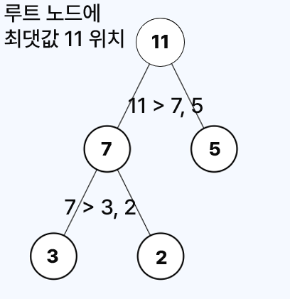
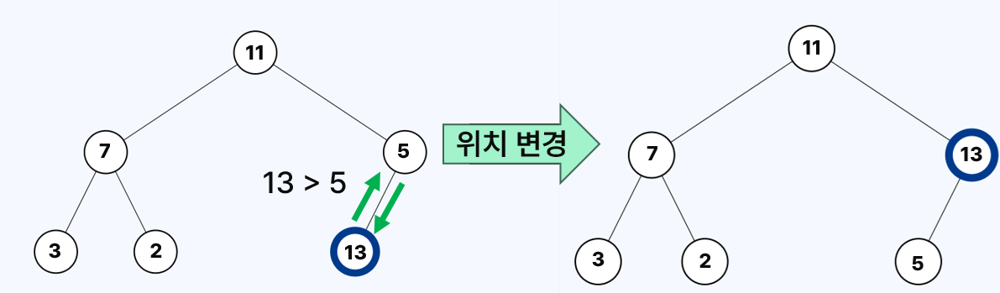
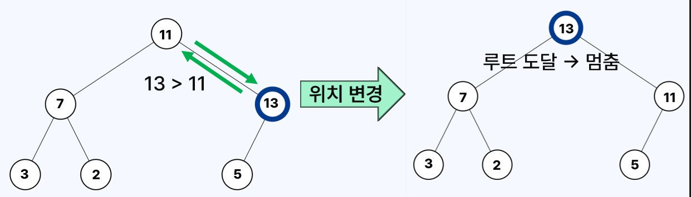
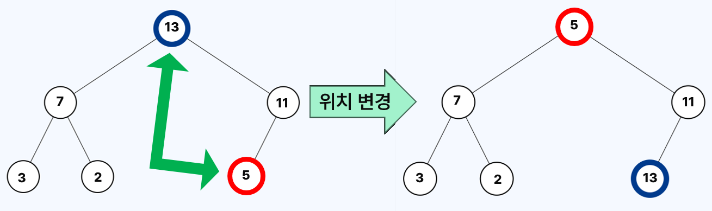
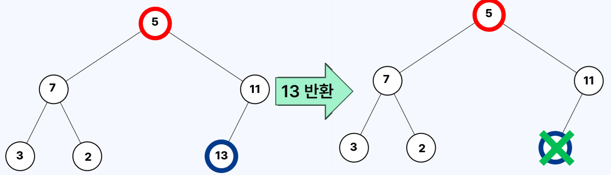
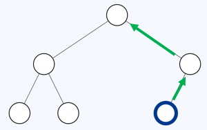
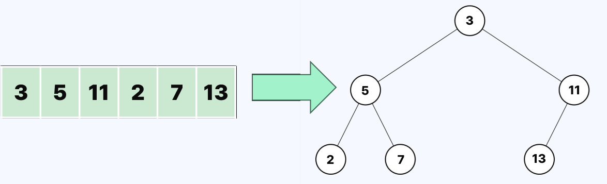
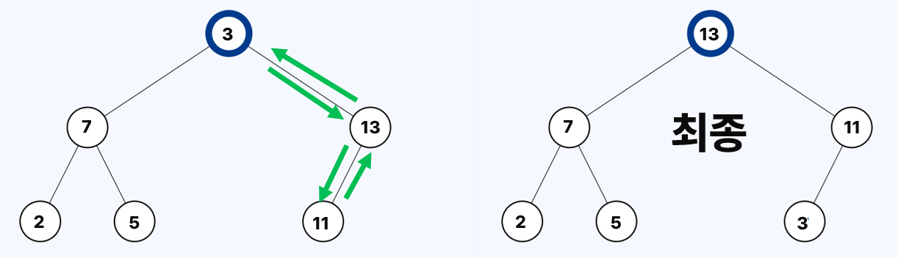

# 최대 힙

- 최대 힙 (Max Heap)은 완전 이진 트리의 한 종류로, 부모 노드가 항상 자식 노드보다 크거나 같은 값을 가진다.
  - 이러한 특성을 **힙 조건을 만족한다**고도 표현한다.
- 따라서 최대 힙의 최댓값은 항상 루트 노드에 위치한다.
  - 팝 연산을 수행하면, 루트 노드의 최댓값이 제거되어 반환된다.
- 새로운 원소가 푸시, 팝될 때마다 힙 조건을 만족할 수 있도록 노드의 위치가 자동으로 조정된다.



- 위 트리는 최대 힙의 예시이다.
- 루트 노드에 최댓값인 `9`가 위치한다.
- 부모 노드 `9`가 자식 노드 `7`, `5`보다 크고, 부모 노드 `7` 역시 자식 노드 `6`, `3`보다 크다.
- 마찬가지로 부모 노드인 7이 자식 노드 6, 3보다 큼을 확인할 수 있다.

# 최대 힙 연산

## 푸시 연산

**(1단계)** 새 원소를 나타내는 노드를 **힙의 마지막 노드 다음 위치에 삽입**한다.

**(2단계**) 삽입한 노드를 힙 조건을 만족하는 위치로 **올려 보낸다**.

- 부모 노드보다 자신의 값이 큰 경우, 부모와 위치를 바꾼다.
- 루트 노드에 도착했거나, 부모 노드보다 자신의 값이 크지 않을 때까지 반복한다.

### 예제


- 위 예제에서는 현재 힙에 `13`을 삽입한다.



- `13`이 부모 `5`보다 크므로, 둘의 위치를 바꾼다.



- `13`이 부모 `11`보다 크므로, 둘의 위치를 바꾼다.
- 이후 `13`이 루트에 도달했으므로, 종료한다.

### 시간 복잡도


- **힙의 높이만큼의 간선**을 따라 부모 노드와 비교 연산을 하며 위로 올라갈 수 있다.
- 원소 수를 $N$으로 둘 때, 힙(완전 이진 트리)의 높이는 $\lfloor{\log_2N}\rfloor$이다.
- 따라서 푸시 연산의 시간 복잡도는 $O(\log N)$이다.

## 팝 연산

**(1단계)** **루트 노드**와 **힙의 마지막 노드**의 위치를 바꾼다.

**(2단계)** 원래 루트 노드였던, **마지막 노드를 힙에서 제거하고 해당 값을 반환**한다.

**(3단계)** 원래 맨 끝 노드였던, 루트 노드를 힙 조건을 만족하는 위치로 **내려 보낸다**.

- 자식 노드 중 자신의 값보다 큰 노드가 있으면, 그 중 가장 큰 자식과 위치를 바꾼다.
- 리프 노드에 도착했거나, 자신의 값보다 큰 자식이 없을 때지 반복한다.

### 예제



- 위 예제의 힙에서 팝 연산을 수행하려고 한다. 루트 노드 `13`과, 마지막 노드 `5`의 위치를 변경한다.



- `13`을 힙에서 제거하고 반환한다. 삽입된 값 중 `13`이 최댓값이었다는 점에 유의한다.


- 새로운 루트 노드 `5`를 내려 보낸다.
- `5`보다 자식 `11`이 크므로, `11`과 위치를 바꾼다.
  - 자식 `7` 역시 `5`보다 크지만, 두 자식이 모두 더 클 경우 더 큰 자식과 위치를 바꾼다.
- 이후 `5`가 리프에 도달했으므로, 종료한다.

### 시간 복잡도



- **힙의 높이만큼의 간선**을 따라 자식 노드와 값 비교 연산을 하며 아래로 내려갈 수 있다.
- 원소 수를 $N$으로 둘 때, 힙(완전 이진 트리)의 높이는 $\lfloor{\log_2N}\rfloor$이다.
  - cf. $\lfloor{x}\rfloor$는 $x$를 가장 가까운 정수로 내리는 연산이다는 뜻이다.
  - 위 예제처럼 $N=7$인 경우, $\lfloor{\log_{2}7}\rfloor = 2$가 된다.
- 따라서 팝 연산의 시간 복잡도는 $O(\log N)$이다.

## 힙 구성

- 배열 등 기존 자료구조의 모든 원소를, **최대 힙 조건을 만족하도록 재배치**하는 연산이다.

**(1단계)** 기존 원소들을 순서대로 완전 이진 트리 형태로 배치한다.

**(2단계)** 자식이 존재하는 마지막 노드부터 역순으로, **각 노드를 힙 조건을 만족하는 위치로 내려 보낸다**.

- 자식 노드 중 자신의 값보다 큰 노드가 있으면, 그 중 가장 큰 자식과 위치를 교환한다.
- 리프 노드에 도착했거나, 더 이상 자신의 값이 자식 노드보다 크지 않을 때까지 반복한다.

### 예제



- 위 예제에선 배열 `[3, 5, 11, 2, 7, 13]`을 최대 힙으로 구성한다.


- `13`, `7`, `2`은 리프 노드이므로 내려보낼 필요가 없다.
- `11`보다 자식 `13`이 크므로, 위치를 바꿔서 내려보낸다.
  - 이후 리프에 도달했으니 멈춘다.
- `5`보다 자식 `7`이 크므로, 위치를 바꿔서 내려보낸다.
  - 이후 리프에 도달했으니 멈춘다.



- `3`보다 자식 `13`이 크므로 위치를 바꾸고, 이후 새 위치에서 `3`보다 자식 `11`이 크므로 다시 위치를 바꾼다.
  - 이후 리프에 도달했으니 멈춘다.
- 모든 노드에 대해 내려보내기를 완료하면, 최대 힙이 완성된다.

### 시간 복잡도


- 원소 수를 $N$으로 둘 때, 모든 노드를 한 번씩 처리하므로, $O(N \log N)$의 시간 복잡도가 걸릴 것이라고 착각하기 쉽다.
- 하지만 트리 하단의 노드는 이동 경로가 짧아, 상대적으로 적은 연산이 필요하다.
- 이를 고려해 각 노드별 연산량을 합산하면, **힙 구성의 전체 시간 복잡도는 $O(N)$에 수렴**한다.

# `heapq` 모듈

- `heapq` 모듈을 사용하면, 파이썬의 리스트를 힙처럼 다룰 수 있다.
  - 즉, 리스트에 값을 삽입 및 삭제할 때마다, 힙 조건을 자동으로 유지하도록 원소의 위치가 재조정된다.
  - 이때 루트 노드의 값은 리스트의 맨 앞 인덱스에 존재한다.
  - 최대값 확인의 시간 복잡도는 간단히 맨 앞 인덱스 값을 읽으면 되므로, $O(1)$이다.
- 파이썬의 `heapq` 모듈은 기본적으로 최소 힙을 기반으로 동작한다.
- 하지만 **푸시, 팝하는 과정에서 값의 부호를 반전**하면, 최대 힙처럼 사용할 수 있다.


## 푸시 연산

- `heapq.heappush(힙, -x)`으로 값 `x`를 부호 반전하여 힙에 푸시한다.
- `heapq`는 최소 힙 기반이므로, 값을 푸시할 때마다 루트에 최솟값이 오도록 원소가 재배치된다.
  - 이때 부호가 반전된 값 중 최솟값은, 원래 값 중 최댓값에 해당된다.
  - 따라서 **루트 노드에는, 부호가 반전된 최댓값이 위치**한다.
- 시간 복잡도는 $O(\log N)$ 이다.

```python
import heapq
heap = []
heapq.heappush(heap, -3)    # 3을 최대 힙에 푸시하는 효과
heapq.heappush(heap, -1)    # 1을 최대 힙에 푸시하는 효과
heapq.heappush(heap, -5)    # 5를 최대 힙에 푸시하는 효과

# 루트 노드의 값 확인
print(-heap[0])             # 5
```

## 팝 연산

- `-heapq.heappop(힙)`으로 힙에서 값을 꺼낸 뒤, 부호를 다시 반전해서 원래 값을 복원한다.
- `heapq`는 최소 힙 기반이므로, 팝 연산은 힙에서 최솟값을 꺼낸다.
  - 반환된 최솟값은 **부호가 반전된 상태이므로, 실제론 최댓값**이다.
  - 반환된 값에 다시 음수 연산을 적용해, 원래 값을 얻어야 한다.
- 시간 복잡도는 $O(\log N)$ 이다.

```python
# 위 코드에서 계속

print(-heapq.heappop(heap)) # 5
print(-heapq.heappop(heap)) # 3
print(-heapq.heappop(heap)) # 1
```

## 힙 구성

- `heapq.heapify(리스트)`를 이용해 기존 리스트의 원소들을 힙 조건을 만족하도록 재배치할 수 있다.
- 다만 최대 힙처럼 사용하려면, **리스트의 모든 값을 부호 반전**한 뒤 `heapify()`를 기존 적용해해야 한다.
- 시간 복잡도는 $O(N)$ 이다.

```python
import heapq

num_list = [2, 5, 7, 9]

# 모든 값을 음수 처리
for i in range(len(num_list)):
    num_list[i] = -num_list[i]

heapq.heapify(num_list)
print(-heapq.heappop(num_list)) # 9
print(-heapq.heappop(num_list)) # 7
print(-heapq.heappop(num_list)) # 5
print(-heapq.heappop(num_list)) # 2
```
